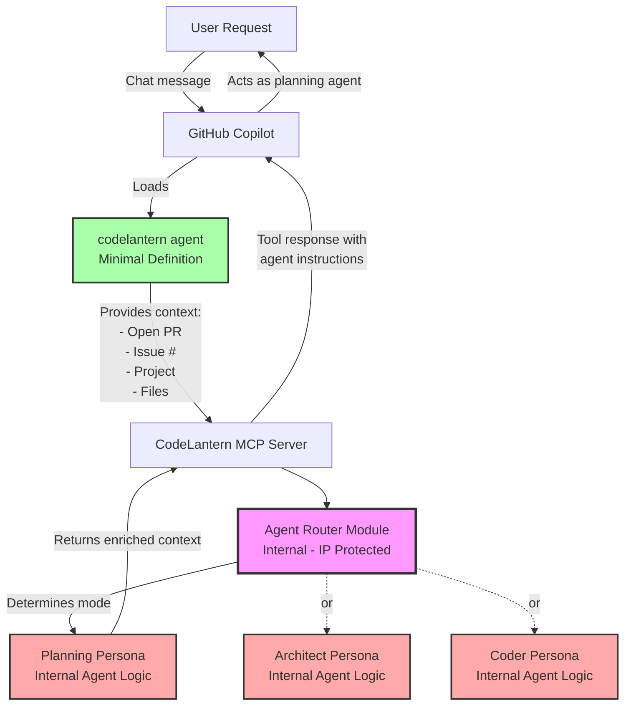
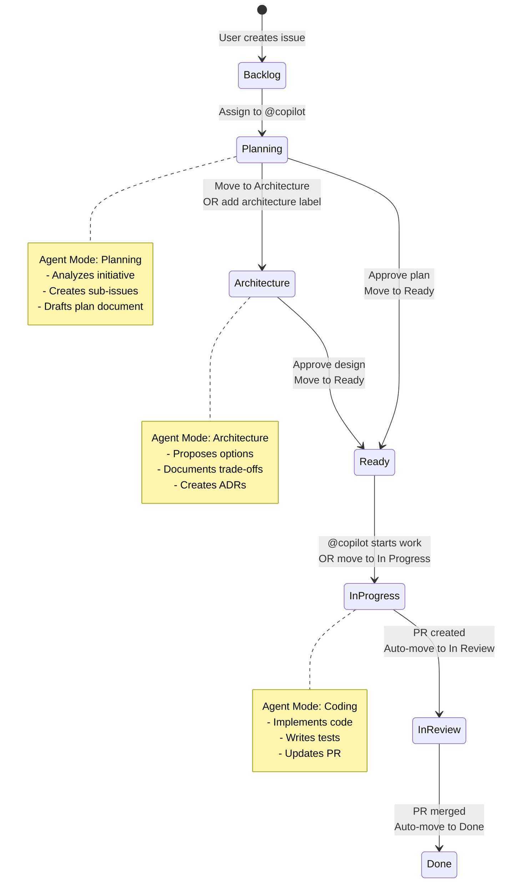
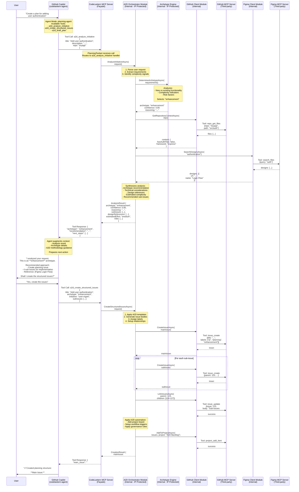

# CodeLantern MCP Server Architecture

## Overview

The goal is to create a **CodeLantern MCP server** that exposes a clean, minimal tool surface to GitHub Copilot while **hiding orchestration logic and protecting intellectual property**. This MCP will act as a façade over multiple third-party MCP servers and APIs, allowing a lightweight Copilot agent definition to leverage CodeLantern's A2D methodology.

**Implementation:** Built using **C#** and the **Microsoft Agent Framework** for MCP server development.

---

## MCP Server Concepts

### Toolsets (High-Level Grouping)

A **toolset** is a logical grouping of related tools, organized by domain or feature area. Toolsets help organize tools and can be selectively enabled/disabled.

**Examples from GitHub MCP:**
- `issues` - All Issue-related operations
- `pull_requests` - PR management tools
- `projects` - GitHub Projects tools
- `repos` - Repository operations

**Proposed CodeLantern Toolsets:**
- `planning` - A2D planning workflow tools
- `delivery` - Code implementation and PR management
- `governance` - Compliance, approvals, quality gates
- `design` - Figma integration, design system tools (optional)

### Tools (Individual Capabilities)

**Tools** are the atomic operations exposed to Copilot. Each tool has:
- A unique name (e.g., `a2d_create_plan`, `a2d_create_issues`)
- Input schema defining parameters
- Output schema defining return values
- Description for LLM understanding

**Example Tool Structure:**
```json
{
  "name": "a2d_create_planning_issue",
  "description": "Create a planning issue following A2D methodology with proper labels and structure",
  "inputSchema": {
    "type": "object",
    "properties": {
      "title": { "type": "string" },
      "initiative": { "type": "string" },
      "archetype": { 
        "type": "string", 
        "enum": ["greenfield", "enhancement", "bug-fix"] 
      }
    },
    "required": ["title", "initiative"]
  }
}
```

### Modules (Internal Implementation)

**Modules** are internal code organization - **not visible** to Copilot, only to the MCP server implementation. Modules contain your proprietary A2D orchestration logic and IP.

**Module Pattern:**
```
CodeLantern.Mcp/
├── CodeLantern.Mcp.sln
├── src/
│   ├── CodeLantern.Mcp.Server/
│   │   ├── Program.cs              # Main MCP server entry point
│   │   ├── McpServer.cs            # Server configuration
│   │   ├── Toolsets/
│   │   │   ├── PlanningToolset.cs  # Planning toolset
│   │   │   ├── DeliveryToolset.cs  # Delivery toolset
│   │   │   └── GovernanceToolset.cs # Governance toolset
│   │   ├── Modules/                # Internal orchestration (IP protected)
│   │   │   ├── GitHubClient.cs     # Calls GitHub MCP internally
│   │   │   ├── FigmaClient.cs      # Calls Figma MCP internally
│   │   │   ├── A2dOrchestrator.cs  # A2D workflow logic
│   │   │   └── ArchetypeEngine.cs  # Archetype selection & rules
│   │   └── Config/
│   │       └── toolsets.json       # Toolset definitions
│   └── CodeLantern.Mcp.Models/
│       └── Schemas/                # Tool input/output schemas
```

---

## Agent Orchestration Strategy

### The Problem: Protecting Agent Definition IP

Agent definitions contain valuable methodology - the instructions on *how* to plan, architect, and code using A2D principles. Distributing multiple agent files (`planning-agent.md`, `solution-architect-agent.md`, `codelantern-coder.md`) exposes this IP.

### The Solution: Single Thin Agent + MCP-Side Agent Routing

Instead of multiple specialized agents in the client repo, use **one minimal agent** that delegates to the MCP server, which then routes to **internal agent personas**.



### Thin Client Agent Definition

**File: `.github/copilot-instructions/codelantern.md`**

```yaml
---
name: codelantern
description: CodeLantern A2D agent - delegates to internal agent orchestration
tools:
  - codelantern-mcp/a2d_route_request
---

You are the CodeLantern A2D agent. Your role is to facilitate AI-Augmented Development workflows.

## Core Behavior

1. **Gather context** from the current environment:
   - Current branch and open PR (if any)
   - Assigned issue number (if any)
   - Project context
   - File changes (if any)

2. **Route to A2D orchestrator** using the `a2d_route_request` tool with all gathered context

3. **Follow returned instructions** - The tool will return:
   - Specific agent mode to operate in (planning, architecture, coding)
   - Detailed instructions for that mode
   - Available tools for the current phase
   - Contextual guidance

4. **Execute as directed** by the returned agent persona

## Context Gathering

Before calling `a2d_route_request`, always gather:
- `pr_number`: Open PR number (use GitHub tools or context)
- `issue_number`: Assigned issue (check PR description or context)
- `branch`: Current branch name
- `project`: Project name (from PR or issue labels)
- `phase`: Current A2D phase (planning, design, implementation, review)
- `user_intent`: User's request in your own words

## Example Flow

User: "Create a plan for authentication"

1. Gather context: no PR, no issue, main branch
2. Call: `a2d_route_request({user_intent: "create plan", pr_number: null, ...})`
3. Receive: Planning agent persona with instructions
4. Execute: Follow planning instructions, use returned tools
```

### MCP Server Implementation: Agent Router

**What the MCP server returns:**

```json
{
  "agent_mode": "planning",
  "instructions": "You are now operating as the A2D Planning Agent. Your role is to analyze initiatives and create structured plans. NEVER write code. Focus on:\n- Understanding user intent\n- Selecting appropriate archetype\n- Breaking work into sub-issues\n- Identifying risks and dependencies",
  "available_tools": [
    "a2d_analyze_initiative",
    "a2d_create_structured_issues",
    "a2d_draft_plan"
  ],
  "context": {
    "archetype_hint": "enhancement",
    "existing_issues": [],
    "related_prs": []
  },
  "constraints": [
    "Do not write code",
    "Do not modify files",
    "Focus on planning and analysis"
  ],
  "next_steps": [
    "Analyze the user's request",
    "Recommend an archetype",
    "Create structured issues"
  ]
}
```

**Implementation:**

```csharp
// AgentRouter.cs - Internal module (IP protected)
public class AgentRouter : IAgentRouter
{
    private readonly IArchetypeEngine _archetypeEngine;
    private readonly IGitHubClient _githubClient;
    private readonly IAgentPersonaRepository _personas;

    [McpTool("a2d_route_request")]
    public async Task<AgentRoutingResponse> RouteRequestAsync(
        [FromBody] RoutingRequest request)
    {
        // 1. Analyze context to determine which agent persona
        var context = await AnalyzeContextAsync(request);
        
        // 2. Determine appropriate agent mode
        var agentMode = DetermineAgentMode(context);
        
        // 3. Load internal agent persona (YOUR IP - hidden in MCP server)
        var persona = await _personas.GetPersonaAsync(agentMode);
        
        // 4. Enrich with contextual data
        var enrichedContext = await EnrichContextAsync(request, context);
        
        // 5. Return agent instructions + tools + context
        return new AgentRoutingResponse
        {
            AgentMode = agentMode,
            Instructions = persona.Instructions,
            AvailableTools = persona.ToolNames,
            Context = enrichedContext,
            Constraints = persona.Constraints,
            NextSteps = GenerateNextSteps(agentMode, context)
        };
    }

    private AgentMode DetermineAgentMode(AnalyzedContext context)
    {
        // Planning phase detection
        if (context.HasNoPR && context.HasNoIssue)
            return AgentMode.Planning;
        
        if (context.IssueLabels.Contains("planning") && !context.IssueLabels.Contains("approved"))
            return AgentMode.Planning;
        
        // Architecture phase detection
        if (context.IssueLabels.Contains("architecture-needed"))
            return AgentMode.Architecture;
        
        if (context.PRDescription.Contains("architecture review"))
            return AgentMode.Architecture;
        
        // Coding phase detection
        if (context.IssueLabels.Contains("ready-for-implementation"))
            return AgentMode.Coding;
        
        if (context.HasOpenPR && !context.IsApproved)
            return AgentMode.Coding;
        
        // Default to planning
        return AgentMode.Planning;
    }
}
```

### Internal Agent Persona Repository

**File: `AgentPersonas/planning-persona.json`** (Internal to MCP server)

```json
{
  "mode": "planning",
  "instructions": "You are the A2D Planning Agent...\n\n## Your Role\n- Analyze user initiatives\n- Select appropriate archetypes\n- Create structured planning documents\n- Generate sub-issues\n\n## Critical Rules\n- NEVER write code\n- NEVER modify implementation files\n- Focus only on planning and analysis\n- Always recommend archetype before proceeding",
  "tools": [
    "a2d_analyze_initiative",
    "a2d_create_structured_issues",
    "a2d_draft_plan",
    "a2d_create_planning_branch"
  ],
  "constraints": [
    "no_code_writing",
    "no_file_modification",
    "planning_phase_only"
  ],
  "personality": {
    "tone": "analytical and structured",
    "focus": "breaking down complexity",
    "output_style": "structured markdown with clear sections"
  }
}
```

**File: `AgentPersonas/architect-persona.json`**

```json
{
  "mode": "architecture",
  "instructions": "You are the A2D Solution Architect Agent...\n\n## Your Role\n- Propose design options with trade-offs\n- Create architecture decision records\n- Evaluate technical approaches\n- Document design rationale\n\n## Critical Rules\n- NEVER write implementation code\n- Provide multiple options with analysis\n- Document trade-offs explicitly\n- Focus on design decisions, not implementation details",
  "tools": [
    "a2d_analyze_architecture",
    "a2d_create_adr",
    "a2d_propose_options",
    "a2d_fetch_designs"
  ],
  "constraints": [
    "no_implementation_code",
    "must_provide_options",
    "must_document_tradeoffs"
  ]
}
```

**File: `AgentPersonas/coder-persona.json`**

```json
{
  "mode": "coding",
  "instructions": "You are the A2D Implementation Agent...\n\n## Your Role\n- Implement approved plans\n- Follow architecture decisions\n- Write production-quality code\n- Ensure test coverage\n\n## Critical Rules\n- Only implement approved plans\n- Follow established architecture\n- Maintain code quality standards\n- Update tests alongside implementation",
  "tools": [
    "a2d_implement_issue",
    "a2d_write_tests",
    "a2d_update_pr",
    "a2d_request_review"
  ],
  "constraints": [
    "requires_approved_plan",
    "must_include_tests",
    "follow_architecture_decisions"
  ]
}
```

### How Context Drives Agent Selection

```csharp
private async Task<AnalyzedContext> AnalyzeContextAsync(RoutingRequest request)
{
    var context = new AnalyzedContext
    {
        HasPR = request.PRNumber.HasValue,
        HasIssue = request.IssueNumber.HasValue,
        Branch = request.Branch,
        UserIntent = request.UserIntent
    };

    // Enrich with GitHub data
    if (context.HasIssue)
    {
        var issue = await _githubClient.GetIssueAsync(request.IssueNumber.Value);
        context.IssueLabels = issue.Labels;
        context.IssueState = issue.State;
    }

    if (context.HasPR)
    {
        var pr = await _githubClient.GetPRAsync(request.PRNumber.Value);
        context.PRDescription = pr.Body;
        context.PRLabels = pr.Labels;
        context.IsApproved = pr.Reviews.Any(r => r.State == "approved");
    }

    return context;
}
```

### Routing Logic Examples

| Context | Detected Mode | Reasoning |
|---------|---------------|-----------|
| No PR, no issue, user asks "create plan" | **Planning** | Starting new initiative |
| Issue #123 with label `planning`, not approved | **Planning** | Still in planning phase |
| Issue #123 with label `architecture-needed` | **Architecture** | Needs design decisions |
| PR #45 with label `architecture-review` | **Architecture** | Design review in progress |
| Issue #123 with label `ready-for-implementation` | **Coding** | Approved, ready to code |
| PR #45 open, not approved, has code | **Coding** | Implementation in progress |
| User explicitly says "@codelantern architect options for..." | **Architecture** | Intent-based override |

### Benefits of This Architecture

✅ **Maximum IP Protection**
- Agent persona logic hidden in MCP server
- Methodology instructions not exposed
- Client only has minimal routing agent

✅ **Single Point of Configuration**
- Users configure one agent: `@codelantern`
- No need to switch between `@planning-agent`, `@architect-agent`, etc.
- Server handles mode switching automatically

✅ **Context-Aware Routing**
- Automatically determines correct mode based on PR/issue state
- No user confusion about which agent to invoke
- Enforces A2D workflow progression

✅ **Dynamic Instructions**
- Agent behavior can be updated server-side
- No need to redistribute agent files
- A/B test different instruction sets

✅ **Flexible Override**
- User intent can override context: "@codelantern architect ..."
- Supports both automatic and explicit mode selection

### User Experience

**Before (Multiple Agents):**
```
User: "Create a plan for auth"
User types: @planning-agent create a plan for auth

[Later, after approval]
User: "Show me design options"
User types: @architect-agent show design options for auth

[Later, after architecture approved]
User: "Implement the login flow"
User types: @coder-agent implement login based on #123
```

**After (Single Agent with MCP Routing):**
```
User: "Create a plan for auth"
User types: @codelantern create a plan for auth
→ MCP detects: no PR, no issue → routes to planning persona

[Later, after approval]
User: "Show me design options"
User types: @codelantern show design options
→ MCP detects: issue #123 has "architecture-needed" → routes to architect persona

[Later, after architecture approved]
User: "Implement the login flow"
User types: @codelantern implement login
→ MCP detects: issue #123 has "ready-for-implementation" → routes to coder persona
```

**Much simpler, IP protected, context-aware!**

### Dual-Entry Architecture: Chat + GitHub Issues

This architecture supports **two entry points** for the same workflow:

#### Entry Point 1: Chat-Based (VS Code, GitHub Chat)

```
User in VS Code → @codelantern create plan for auth
                 ↓
            Thin agent gathers context
                 ↓
            Calls a2d_route_request
                 ↓
            MCP routes to planning persona
                 ↓
            Returns planning instructions
                 ↓
            Agent creates planning issue
```

#### Entry Point 2: GitHub Issues (Assign to Copilot)

```
User creates GitHub issue
  Title: "Add user authentication"
  Labels: [planning] or Project column: Planning
  Assigns to: @copilot with agent: codelantern
                 ↓
            GitHub triggers Copilot
                 ↓
            Thin agent gathers context (issue #, labels, project)
                 ↓
            Calls a2d_route_request with issue context
                 ↓
            MCP detects "planning" label → routes to planning persona
                 ↓
            Agent works within the issue (comments, creates sub-issues)
```

### Project Board Integration

**Recommended Project Structure:**

```
A2D Project Board
├── 📋 Backlog       (new issues, not yet analyzed)
├── 🧠 Planning      (assigned to copilot, planning persona active)
├── 🏗️  Architecture (design decisions needed, architect persona active)
├── ✅ Ready         (approved, ready for implementation)
├── 💻 In Progress   (assigned to copilot, coder persona active)
├── 👀 In Review     (PR open, awaiting approval)
└── ✨ Done          (merged, completed)
```

### Enhanced Context Detection

```csharp
private AgentMode DetermineAgentMode(AnalyzedContext context)
{
    // Method 1: Project column status (preferred)
    if (context.ProjectColumn != null)
    {
        return context.ProjectColumn switch
        {
            "Backlog" => AgentMode.Planning,
            "Planning" => AgentMode.Planning,
            "Architecture" => AgentMode.Architecture,
            "Ready" => AgentMode.Coding,
            "In Progress" => AgentMode.Coding,
            "In Review" => AgentMode.Review,
            _ => AgentMode.Planning
        };
    }
    
    // Method 2: Issue labels (fallback)
    if (context.IssueLabels.Contains("planning"))
        return AgentMode.Planning;
    
    if (context.IssueLabels.Contains("architecture"))
        return AgentMode.Architecture;
    
    if (context.IssueLabels.Contains("ready-for-implementation"))
        return AgentMode.Coding;
    
    // Method 3: Intent-based (from chat)
    if (context.UserIntent?.Contains("architect") == true || 
        context.UserIntent?.Contains("design options") == true)
        return AgentMode.Architecture;
    
    if (context.UserIntent?.Contains("implement") == true || 
        context.UserIntent?.Contains("code") == true)
        return AgentMode.Coding;
    
    // Default: Planning
    return AgentMode.Planning;
}
```

### Routing Decision Matrix

| Trigger | Context | Detected Mode | Agent Behavior |
|---------|---------|---------------|----------------|
| **Chat** | User: "@codelantern create plan" | Planning | Creates issue in Planning column |
| **Issue** | Moved to Planning column | Planning | Comments with analysis, creates sub-issues |
| **Issue** | Label: `planning` added | Planning | Same as above |
| **Issue** | Moved to Architecture column | Architecture | Comments with design options, creates ADR |
| **Issue** | Label: `architecture` added | Architecture | Same as above |
| **Chat** | User: "@codelantern show design options" on issue #123 | Architecture | Proposes architectural approaches |
| **Issue** | Moved to Ready column | Coding | Creates implementation PR, links to issue |
| **Issue** | Label: `ready-for-implementation` | Coding | Same as above |
| **PR** | Assigned to @copilot, issue in "In Progress" | Coding | Implements code, updates PR |
| **Chat** | User: "@codelantern implement #123" | Coding | Creates branch, implements, opens PR |

### Workflow Automation with Project Columns



### Example: Issue-Based Flow

**Step 1: User Creates Issue**

```markdown
Title: Add user authentication
Body: We need to add authentication to protect user data
Labels: (none initially)
Project: A2D Project → Backlog
Assignee: (none)
```

**Step 2: User Assigns to Copilot**

```
User moves issue to "Planning" column
User assigns issue to @copilot
User selects agent: codelantern
```

**Step 3: Copilot Activates**

```
Copilot (thin agent):
  1. Gathers context:
     - issue_number: 123
     - project_column: "Planning"
     - labels: []
     - current_assignee: "@copilot"
  
  2. Calls: a2d_route_request({
       issue_number: 123,
       project_column: "Planning",
       user_intent: "analyze and plan"
     })
  
  3. Receives: Planning persona instructions
  
  4. Acts as planning agent:
     - Analyzes issue
     - Comments with archetype recommendation
     - Creates sub-issues
     - Links sub-issues to parent
     - Updates project board
```

**Step 4: Copilot Comments on Issue**

```markdown
## 🧠 A2D Planning Analysis

**Archetype:** Enhancement  
**Confidence:** 85%

**Reasoning:**  
This initiative adds new functionality to an existing system. Based on the description, 
this requires authentication infrastructure that doesn't currently exist.

**Recommended Approach:**

I've created a structured breakdown:

**Sub-Issues:**
- #124 - Backend: JWT authentication API
- #125 - Frontend: Login/logout UI components
- #126 - Middleware: Session management
- #127 - Documentation & testing

**Design References:**
- [Figma: Login Flow](https://figma.com/file/...)

**Next Steps:**
1. Review this breakdown
2. If approved, move to **Architecture** column for design decisions
3. Or move directly to **Ready** if design is straightforward

**Estimated Effort:** Medium (2-3 sprints)  
**Risk Level:** Medium - requires security review
```

**Step 5: User Reviews and Moves to Architecture**

```
User reviews planning comment
User moves issue #123 to "Architecture" column
```

**Step 6: Copilot Switches to Architecture Mode**

```
Copilot detects column change → Architecture
Calls: a2d_route_request({ issue_number: 123, project_column: "Architecture" })
Receives: Architecture persona instructions
Comments with design options...
```

### Benefits of Dual-Entry Architecture

✅ **Flexibility**
- Users can work from chat (VS Code, GitHub Copilot Chat)
- OR from GitHub Issues (web, mobile)
- Same agent, same workflow, different interfaces

✅ **Visibility**
- Issue-based work is visible in project board
- Team can see progress without asking
- Audit trail of decisions in issue comments

✅ **Automation**
- Project column changes trigger mode switches
- No need to remember labels
- Visual workflow matches agent behavior

✅ **Team Collaboration**
- Copilot does initial analysis
- Humans review and approve
- Move to next column → Copilot continues
- Blended human-AI workflow

✅ **Asynchronous Work**
- User creates issue, assigns to Copilot
- Copilot works asynchronously
- User reviews when ready
- No need for synchronous chat session

### Configuration Example

**Client Repository Setup:**

```yaml
# .github/copilot-instructions/codelantern.md
---
name: codelantern
description: CodeLantern A2D agent
tools:
  - codelantern-mcp/a2d_route_request
---
# (minimal instructions as shown earlier)
```

```yaml
# .github/workflows/a2d-project-automation.yml
name: A2D Project Automation

on:
  issues:
    types: [assigned]
  project_card:
    types: [moved]

jobs:
  trigger-copilot:
    runs-on: ubuntu-latest
    steps:
      - name: Check if assigned to Copilot
        if: github.event.issue.assignee.login == 'copilot'
        run: echo "Copilot assigned, will activate codelantern agent"
      
      # GitHub automatically triggers Copilot with assigned agent
```

**Project Board Setup:**

```
Repository Settings → Projects → New Project
Template: Basic Kanban
Columns: Backlog, Planning, Architecture, Ready, In Progress, In Review, Done

Automation:
- When issue assigned to @copilot → Add to project
- When PR created → Move to In Review
- When PR merged → Move to Done
```

**Much simpler, IP protected, context-aware, AND GitHub-native!**

---

## MCP Server Architecture Overview

### Façade Pattern: Single Entry Point

```
codelantern-agent → codelantern-mcp-server → third-party MCP servers + APIs
```

**External View (What Copilot Sees):**

```
Copilot Agent → CodeLantern MCP Server
                 ↓
                 Exposes: ["a2d_route_request", "a2d_analyze_initiative", 
                           "a2d_create_issues", "a2d_track_progress"]
```

**Internal Implementation:**

```
a2d_route_request (tool)
  ↓
Agent Router Module (determines agent persona - YOUR IP)
  ↓ loads
Internal Agent Persona (planning/architect/coder - YOUR IP)
  ↓ uses
A2D Orchestrator (workflow logic - YOUR IP)
  ↓ calls
  ├── GitHub Module → github-mcp-server (issue_create, pr_create)
  ├── Figma Module → figma-mcp-server (get_designs)
  └── Archetype Engine → selects workflow based on initiative type
```

### Architecture Benefits

**Maximum IP Protection:**
- ✅ Copilot sees **one MCP server** with a curated set of tools
- ✅ All sensitive logic lives inside `codelantern-mcp`
- ✅ Agent persona instructions hidden in server
- ✅ Orchestration logic hidden in internal modules

**Simple Configuration:**
- ✅ One thin agent definition in client repos
- ✅ Clean distribution via GitHub MCP registry
- ✅ Simplifies setup for end users
- ✅ Branded tool names matching A2D terminology

**Flexible Architecture:**
- ✅ Internal calls to GitHub MCP, Figma MCP, REST APIs, etc.
- ✅ Fan out internally to any number of MCP servers
- ✅ Update internal implementations without breaking clients
- ✅ Modular internal organization

### Internal Module Organization

**Internal Modules:**
- `agent_router` - Routes requests to appropriate agent persona (YOUR IP)
- `agent_personas` - Planning/Architecture/Coding persona definitions (YOUR IP)
- `planning_module` - A2D planning workflows
- `delivery_module` - Code delivery and PR management
- `github_module` - GitHub MCP client wrapper
- `figma_module` - Figma MCP client wrapper
- `governance_module` - Quality gates and compliance
- `a2d_orchestrator` - Core A2D workflow engine (YOUR IP)
- `archetype_engine` - Archetype selection and rules (YOUR IP)

---

## Proposed Toolset Design

### 1. Planning Toolset

**Purpose:** A2D planning phase tools

**Tools:**
- `a2d_analyze_initiative` - Analyzes user request, suggests archetype
- `a2d_create_planning_branch` - Creates branch following A2D naming conventions
- `a2d_draft_plan` - Generates A2D plan document in planning PR
- `a2d_create_structured_issues` - Creates main issue + sub-issues with proper labels
- `a2d_update_planning_pr` - Updates planning PR with analysis and recommendations

**Internal modules used:**
```csharp
// Example: PlanningToolset.cs
public class PlanningToolset
{
    private readonly IA2dOrchestrator _orchestrator;
    private readonly IGitHubClient _githubClient;

    [McpTool("a2d_create_structured_issues")]
    public async Task<IssueCreationResult> CreateStructuredIssuesAsync(
        string title, 
        string initiative, 
        string archetype)
    {
        // 1. Use A2D Orchestrator to determine issue structure (YOUR IP)
        var structure = await _orchestrator.PlanIssueStructureAsync(archetype);
        
        // 2. Use GitHub module to create issues
        var mainIssue = await _githubClient.CreateIssueAsync(new IssueRequest
        {
            Title = title,
            Body = structure.MainIssueBody,
            Labels = new[] { "ai", "planning", archetype }
        });
        
        // 3. Create sub-issues
        var subIssues = new List<Issue>();
        foreach (var subIssueSpec in structure.SubIssues)
        {
            var created = await _githubClient.CreateIssueAsync(new IssueRequest
            {
                Title = subIssueSpec.Title,
                Body = subIssueSpec.Body,
                Labels = subIssueSpec.Labels,
                Parent = mainIssue.Number
            });
            subIssues.Add(created);
        }
        
        // 4. Apply A2D workflow automation
        await _orchestrator.SetupWorkflowTriggersAsync(mainIssue.Number);
        
        return new IssueCreationResult 
        { 
            MainIssue = mainIssue, 
            SubIssues = subIssues 
        };
    }
}
```

### 2. Delivery Toolset

**Purpose:** Code implementation and PR management

**Tools:**
- `a2d_create_implementation_branch` - Creates feature branch from planning
- `a2d_create_pr` - Creates PR with A2D template and labels
- `a2d_request_review` - Assigns reviewers based on archetype rules
- `a2d_check_quality_gates` - Validates code against A2D quality standards
- `a2d_merge_with_validation` - Merges PR after A2D workflow validation

### 3. Governance Toolset

**Purpose:** Compliance, approvals, and quality gates

**Tools:**
- `a2d_validate_compliance` - Checks compliance requirements
- `a2d_require_approval` - Enforces approval gates based on archetype
- `a2d_audit_trail` - Records A2D workflow progression
- `a2d_quality_report` - Generates quality metrics report

### 4. Design Toolset (Optional)

**Purpose:** Figma integration and design system tools

**Tools:**
- `a2d_fetch_designs` - Retrieves Figma designs for implementation
- `a2d_validate_design_tokens` - Ensures design system compliance
- `a2d_link_design_to_issue` - Associates Figma URLs with issues

---

## Implementation with Microsoft Agent Framework

### Project Structure

```
CodeLantern.Mcp/
├── CodeLantern.Mcp.sln
├── src/
│   ├── CodeLantern.Mcp.Server/
│   │   ├── Program.cs                      # MCP server entry point
│   │   ├── McpServer.cs                    # Server configuration
│   │   ├── Startup.cs                      # Dependency injection setup
│   │   ├── Toolsets/
│   │   │   ├── IToolset.cs                 # Toolset interface
│   │   │   ├── PlanningToolset.cs          # Planning tool definitions & handlers
│   │   │   ├── DeliveryToolset.cs          # Delivery tool definitions & handlers
│   │   │   └── GovernanceToolset.cs        # Governance tool definitions & handlers
│   │   ├── Modules/                        # Internal modules (IP protected)
│   │   │   ├── A2d/
│   │   │   │   ├── IA2dOrchestrator.cs     # Interface
│   │   │   │   ├── A2dOrchestrator.cs      # Core A2D workflow logic
│   │   │   │   ├── IArchetypeEngine.cs     # Interface
│   │   │   │   ├── ArchetypeEngine.cs      # Archetype selection
│   │   │   │   └── WorkflowRules.cs        # A2D methodology rules
│   │   │   ├── Clients/
│   │   │   │   ├── IGitHubClient.cs        # Interface
│   │   │   │   ├── GitHubClient.cs         # GitHub MCP wrapper
│   │   │   │   ├── IFigmaClient.cs         # Interface
│   │   │   │   ├── FigmaClient.cs          # Figma MCP wrapper
│   │   │   │   └── HttpClientBase.cs       # Base HTTP client
│   │   │   └── Utils/
│   │   │       ├── ValidationHelper.cs     # Input validation
│   │   │       └── TemplateEngine.cs       # A2D templates
│   │   ├── Config/
│   │   │   ├── toolsets.json               # Toolset configuration
│   │   │   └── archetypes.json             # Archetype definitions
│   │   └── appsettings.json                # Application settings
│   ├── CodeLantern.Mcp.Models/
│   │   ├── Requests/                       # Tool input models
│   │   ├── Responses/                      # Tool output models
│   │   └── Schemas/                        # JSON schemas
│   └── CodeLantern.Mcp.Contracts/
│       ├── IA2dOrchestrator.cs             # Core interfaces
│       └── IToolset.cs                     # Toolset contracts
└── tests/
    ├── CodeLantern.Mcp.Server.Tests/
    │   ├── Toolsets/
    │   └── Modules/
    └── CodeLantern.Mcp.Integration.Tests/
```

### Key Benefits

**IP Protection:**
- Copilot only sees high-level tools like `a2d_create_plan`
- Your A2D orchestration logic, archetype selection, and workflow rules remain hidden
- Internal modules can call multiple MCP servers without exposing composition

**Simplicity for Users:**
- One MCP server to configure
- Clean, branded tool names matching A2D terminology
- No need to understand GitHub MCP, Figma MCP, etc.

**Flexibility:**
- Swap internal implementations without changing tool signatures
- Add new third-party MCPs internally
- Version control orchestration logic separately from tool definitions
- Test modules independently

**Microsoft Agent Framework with C# Advantages:**
- .NET ecosystem with robust libraries
- Strong typing throughout the stack
- Built-in dependency injection and configuration
- Excellent async/await support for I/O operations
- JSON schema validation via System.Text.Json
- Easy integration with GitHub MCP and other services
- Enterprise-grade security and performance
- Active development and community support
- Familiar language for Microsoft-centric enterprises

---

## Detailed Flow Example

### User Request: "Create a plan for adding user authentication"

This example demonstrates the complete flow from user prompt through all architectural layers.



### Layer-by-Layer Breakdown

#### Layer 1: User ↔ GitHub Copilot (codelantern-agent)

**What happens:**
- User provides natural language request
- Copilot operates in `planning-agent` mode (see `planning-agent.md`)
- Agent has access to specific tools: `a2d_analyze_initiative`, `a2d_create_structured_issues`, `a2d_draft_plan`
- Agent decides which tool to call based on user intent
- Agent receives structured tool response
- Agent formulates natural language response with context

**Key characteristics:**
- Copilot sees **only** the clean tool interface
- No visibility into internal orchestration
- Tool descriptions guide LLM on when/how to use tools
- Agent can chain multiple tool calls based on responses

#### Layer 2: CodeLantern MCP Server (Façade)

**What happens:**
- Receives tool invocation from Copilot
- Routes to appropriate Toolset (e.g., `PlanningToolset`)
- Validates input parameters against JSON schema
- Delegates to internal orchestration modules
- Formats response according to tool output schema
- Returns structured data to Copilot

**Example code flow:**
```csharp
// PlanningToolset.cs
[McpTool("a2d_analyze_initiative")]
public async Task<AnalysisResult> AnalyzeInitiativeAsync(
    [FromBody] AnalyzeRequest request)
{
    // 1. Validate input
    ValidateRequest(request);
    
    // 2. Delegate to orchestrator (internal module)
    var analysis = await _orchestrator.AnalyzeInitiativeAsync(request);
    
    // 3. Format response
    return new AnalysisResult 
    {
        Archetype = analysis.Archetype,
        Confidence = analysis.Confidence,
        Recommendation = analysis.Recommendation,
        NextSteps = analysis.NextSteps
    };
}
```

**Key characteristics:**
- Thin routing layer
- Input validation
- Response formatting
- **No business logic** - delegates everything

#### Layer 3: A2D Orchestrator Module (Internal - IP Protected)

**What happens:**
- Receives high-level intent from toolset
- Implements **A2D methodology logic** (your IP)
- Orchestrates calls to multiple internal modules
- Applies archetype-specific rules
- Synthesizes results from multiple sources
- Returns structured analysis

**Example orchestration logic:**
```csharp
// A2dOrchestrator.cs
public async Task<InitiativeAnalysis> AnalyzeInitiativeAsync(
    AnalyzeRequest request)
{
    // 1. Determine archetype using proprietary logic
    var archetype = await _archetypeEngine.DetermineArchetypeAsync(
        request.Title, 
        request.Description);
    
    // 2. Get repository context (calls GitHub internally)
    var repoContext = await _githubClient.GetRepositoryContextAsync(
        request.Repository);
    
    // 3. Search for related designs (calls Figma internally)
    var designs = await _figmaClient.SearchDesignsAsync(
        ExtractKeywords(request.Description));
    
    // 4. Apply A2D planning rules (your IP)
    var structure = await _archetypeEngine.GenerateIssueStructureAsync(
        archetype, repoContext, designs);
    
    // 5. Synthesize recommendation
    return new InitiativeAnalysis
    {
        Archetype = archetype.Name,
        Confidence = archetype.Confidence,
        Reasoning = archetype.Reasoning,
        SubIssues = structure.SubIssues,
        DesignReferences = designs,
        EstimatedEffort = CalculateEffort(structure),
        Risks = IdentifyRisks(archetype, repoContext),
        NextSteps = GenerateNextSteps(archetype)
    };
}
```

**Key characteristics:**
- **Core IP lives here**
- Multi-source data synthesis
- Archetype-driven decision making
- A2D workflow enforcement
- Completely hidden from external consumers

#### Layer 4: Client Modules (Internal Wrappers)

**What happens:**
- Wrap third-party MCP servers and APIs
- Provide clean, typed interfaces to orchestrator
- Handle authentication and error handling
- Cache responses when appropriate
- Translate between internal and external data models

**Example GitHub client:**
```csharp
// GitHubClient.cs
public class GitHubClient : IGitHubClient
{
    private readonly IMcpClient _githubMcp;
    
    public async Task<Issue> CreateIssueAsync(IssueRequest request)
    {
        // Call GitHub MCP server
        var response = await _githubMcp.CallToolAsync(
            "issue_create", 
            new 
            {
                title = request.Title,
                body = request.Body,
                labels = request.Labels,
                assignees = request.Assignees
            });
        
        // Translate response to internal model
        return new Issue
        {
            Number = response.number,
            Url = response.html_url,
            State = response.state
        };
    }
    
    public async Task<RepositoryContext> GetRepositoryContextAsync(
        string repository)
    {
        // Multiple MCP calls to gather context
        var files = await _githubMcp.CallToolAsync("repo_get_files", 
            new { repo = repository });
        var branches = await _githubMcp.CallToolAsync("repo_list_branches",
            new { repo = repository });
        var prs = await _githubMcp.CallToolAsync("pr_list",
            new { repo = repository, state = "open" });
        
        // Synthesize into meaningful context
        return new RepositoryContext
        {
            HasAuthFiles = files.Any(f => f.path.Contains("auth")),
            Framework = DetectFramework(files),
            ActiveBranches = branches.Count,
            OpenPRs = prs.Count
        };
    }
}
```

**Key characteristics:**
- Abstraction over third-party MCPs
- Type safety
- Error handling
- Response caching
- Internal data models

#### Layer 5: Third-Party MCP Servers

**What happens:**
- GitHub MCP Server handles GitHub API calls
- Figma MCP Server handles Figma API calls
- Other MCPs for Jira, Slack, etc.
- Each MCP exposes its own tool interface
- **Never directly accessed by Copilot** in this architecture

### Context Augmentation Pattern

One powerful aspect of this architecture is **progressive context building**:

```
User Prompt (minimal context)
    ↓
Copilot Agent (adds agent mode context)
    ↓
MCP Server Toolset (adds tool schema context)
    ↓
A2D Orchestrator (adds archetype rules, methodology context)
    ↓
Client Modules (add repository data, design data, etc.)
    ↓
Result (fully contextualized, synthesized response)
```

Each layer **enriches the context** without exposing internal complexity to the user or agent.

### Benefits of This Architecture

1. **IP Protection**: A2D orchestration logic completely hidden from consumers
2. **Clean Separation**: Each layer has a single, well-defined responsibility
3. **Testability**: Each module can be unit tested independently
4. **Flexibility**: Swap internal implementations without affecting tool interface
5. **Scalability**: Add new toolsets/modules without changing existing code
6. **Maintainability**: Clear boundaries make debugging and updates straightforward
7. **User Experience**: Simple tool interface, complex orchestration hidden

---

## Next Steps

1. **Define Core Toolsets** - Start with Planning and Delivery toolsets
2. **Map A2D Workflows** - Document how planning-workflow.md maps to tools
3. **Implement Planning Module** - Build first toolset with A2D orchestration
4. **Create GitHub Client Wrapper** - Internal module for GitHub MCP calls
5. **Test & Iterate** - Validate tool design with real A2D workflows
6. **Package for Distribution** - Prepare for GitHub MCP registry

---

**Last updated:** November 27, 2025

---

© 2025 TechLantern / CodeLantern.AI. For internal use and approved partner engagements only.
