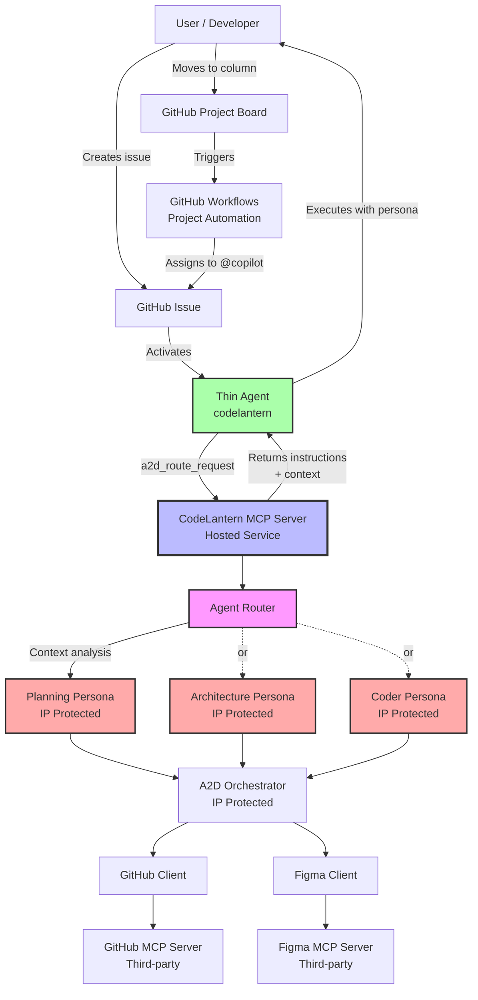

# A2D Flow with MCP Implementation

## Overview

This document describes how the [simplified A2D flow](./simplified-a2d-flow.md) is implemented using:
- **Single `codelantern` agent** (thin client agent in user's repository)
- **CodeLantern MCP Server** (hosted service with IP-protected orchestration)
- **GitHub Project Workflows** (automation for column-based triggers)

The key insight: The thin agent delegates all decisions to the MCP server, which routes requests to internal agent personas (planning, architecture, coding) based on workflow context.

---

## Architecture Components



---

## Component Responsibilities

### 1. Thin Agent (`codelantern`)

**Location:** `.github/copilot-instructions/codelantern.md` in client repository

**Responsibilities:**
- Gather workflow context (issue #, PR #, project column, branch)
- Call `a2d_route_request` tool with context
- Receive dynamic instructions and available tools from MCP server
- Execute as directed by returned agent persona

**Does NOT contain:**
- Workflow logic
- Agent persona instructions
- A2D methodology

### 2. CodeLantern MCP Server

**Location:** Hosted service (SaaS or self-hosted)

**Responsibilities:**
- Receive routing requests with context
- Determine appropriate agent persona
- Load internal persona instructions (IP protected)
- Orchestrate multi-step workflows
- Call third-party MCP servers (GitHub, Figma)
- Return enriched context and instructions to thin agent

**Contains (IP Protected):**
- Agent Router logic
- Planning/Architecture/Coder persona definitions
- A2D orchestration rules
- Archetype engine
- Workflow automation logic

### 3. GitHub Project Workflows

**Location:** GitHub Project settings + `.github/workflows/` in client repository

**Responsibilities:**
- Detect column movements (Backlog → Planning → Ready, etc.)
- Auto-assign issues to @copilot when moved to Planning or Ready columns
- Move issues between columns based on PR state
- Close issues when implementation PRs merge

**Triggering Events:**
- Issue moved to Planning column → Assign to @copilot
- Issue moved to Ready column → Assign available sub-issue to @copilot
- PR marked ready for review → Move issue to In Review
- PR merged → Move issue to Code Complete, close issue

---

## Flow Implementation: Phase by Phase

### Phase 1: Backlog → Planning

#### User Action: Moves Issue to Planning Column

**GitHub Event:**
```json
{
  "action": "moved",
  "project_card": {
    "column_name": "Planning",
    "content_url": "https://api.github.com/repos/user/repo/issues/123"
  }
}
```

**GitHub Workflow Triggers:**
```yaml
# .github/workflows/a2d-auto-assign.yml
name: A2D Auto-assign
on:
  project_card:
    types: [moved]

jobs:
  assign-planning:
    if: github.event.project_card.column_name == 'Planning'
    runs-on: ubuntu-latest
    steps:
      - name: Assign to Copilot
        run: |
          gh issue edit $ISSUE_NUMBER --add-assignee copilot
```

**Outcome:** Issue #123 assigned to @copilot with codelantern agent

---

#### Agent Activation: Thin Agent Gathers Context

**Copilot Activation:**
```
GitHub detects assignment to @copilot
Loads agent: codelantern (from .github/copilot-instructions/codelantern.md)
Agent activates with issue context
```

**Thin Agent Actions:**
```javascript
// Pseudo-code for what thin agent does
async function handleIssueAssignment(issue) {
  // 1. Gather context
  const context = {
    issue_number: issue.number,
    issue_title: issue.title,
    issue_body: issue.body,
    issue_labels: issue.labels,
    project_column: "Planning", // from project API
    pr_number: null, // no PR yet
    branch: null,
    user_intent: "plan initiative" // inferred
  };
  
  // 2. Call MCP server routing tool
  const response = await callTool('a2d_route_request', context);
  
  // 3. Receive persona instructions
  // response = {
  //   agent_mode: "planning",
  //   instructions: "You are the A2D Planning Agent...",
  //   available_tools: ["a2d_create_planning_pr", "a2d_draft_ux_design", ...],
  //   context: { archetype_hint: "enhancement", ... },
  //   next_steps: ["Create planning PR", "Analyze requirements", ...]
  // }
  
  // 4. Execute as planning agent
  await executeWithPersona(response);
}
```

---

#### MCP Server: Routes to Planning Persona

**MCP Server Receives Request:**
```json
{
  "tool": "a2d_route_request",
  "params": {
    "issue_number": 123,
    "issue_title": "Add user authentication",
    "issue_body": "We need to add authentication...",
    "project_column": "Planning",
    "pr_number": null,
    "branch": null,
    "user_intent": "plan initiative"
  }
}
```

**Agent Router Logic:**
```csharp
// AgentRouter.cs
public async Task<AgentRoutingResponse> RouteRequestAsync(RoutingRequest request)
{
    // 1. Analyze context
    var context = await AnalyzeContextAsync(request);
    // context.ProjectColumn = "Planning"
    // context.HasPR = false
    // context.Phase = "planning"
    
    // 2. Determine agent mode
    var agentMode = DetermineAgentMode(context);
    // agentMode = AgentMode.Planning
    
    // 3. Load planning persona (from internal storage - IP protected)
    var persona = await _personaRepository.GetPersonaAsync(agentMode);
    // persona.Instructions = "You are the A2D Planning Agent. Your role is to..."
    // persona.Tools = ["a2d_create_planning_pr", "a2d_draft_ux_design", ...]
    
    // 4. Enrich context with A2D analysis
    var enrichedContext = await EnrichContextAsync(request, context);
    // - Fetches similar issues from GitHub
    // - Suggests archetype based on description
    // - Identifies potential design needs
    
    // 5. Return persona instructions + context
    return new AgentRoutingResponse
    {
        AgentMode = "planning",
        Instructions = persona.Instructions,
        AvailableTools = persona.Tools,
        Context = enrichedContext,
        Constraints = persona.Constraints,
        NextSteps = new[]
        {
            "Create planning PR",
            "Analyze requirements and suggest archetype",
            "Draft UX design",
            "Draft architecture decisions",
            "Propose work-item breakdown"
        }
    };
}
```

**MCP Response to Thin Agent:**
```json
{
  "agent_mode": "planning",
  "instructions": "You are the A2D Planning Agent. Your role is to create comprehensive plans that include UX design, architecture decisions, and work-item breakdown. NEVER write implementation code. Work in draft mode until user approves.\n\n## Your Workflow\n1. Create planning PR\n2. Draft UX design\n3. Draft architecture\n4. Propose work-item breakdown\n5. Iterate with user feedback\n6. Create final sub-issues when approved",
  "available_tools": [
    "a2d_create_planning_pr",
    "a2d_draft_ux_design",
    "a2d_draft_architecture",
    "a2d_propose_breakdown",
    "a2d_create_sub_issues"
  ],
  "context": {
    "archetype_hint": "enhancement",
    "complexity": "medium-high",
    "similar_issues": [],
    "design_needed": true,
    "architecture_needed": true
  },
  "constraints": [
    "no_implementation_code",
    "draft_mode_until_approved",
    "comprehensive_planning_required"
  ],
  "next_steps": [
    "Create planning PR for issue #123",
    "Analyze requirements (authentication is an enhancement)",
    "Draft UX design for login/register flows",
    "Draft architecture (JWT-based auth)",
    "Propose work-item breakdown (8-10 sub-issues)"
  ]
}
```

---

#### Agent Executes as Planning Persona

**Thin Agent Actions (now operating with planning persona):**

**Step 1: Create Planning PR**

Agent calls: `a2d_create_planning_pr`

```json
{
  "tool": "a2d_create_planning_pr",
  "params": {
    "issue_number": 123,
    "branch_name": "planning/123-add-user-authentication"
  }
}
```

**MCP Server Creates PR:**
```csharp
// PlanningToolset.cs
[McpTool("a2d_create_planning_pr")]
public async Task<PlanningPrResult> CreatePlanningPrAsync(CreatePlanningPrRequest request)
{
    // 1. Create branch via GitHub MCP
    var branch = await _githubClient.CreateBranchAsync(
        request.BranchName,
        baseBranch: "main"
    );
    
    // 2. Generate initial planning document from template
    var planningDoc = await _templateEngine.GeneratePlanningDocumentAsync(
        request.IssueNumber,
        archetype: "enhancement" // from context
    );
    
    // 3. Commit planning document to branch
    await _githubClient.CommitFileAsync(
        branch: request.BranchName,
        path: "docs/planning/issue-123-plan.md",
        content: planningDoc
    );
    
    // 4. Create draft PR
    var pr = await _githubClient.CreatePullRequestAsync(new PrRequest
    {
        Title = $"Planning: Add user authentication (Issue #123)",
        Body = GeneratePlanningPrBody(request.IssueNumber),
        Head = request.BranchName,
        Base = "main",
        Draft = true,
        Labels = new[] { "planning", "a2d" }
    });
    
    return new PlanningPrResult
    {
        PrNumber = pr.Number,
        PrUrl = pr.Url,
        BranchName = request.BranchName
    };
}
```

**Outcome:** Draft PR #125 created for planning

---

**Step 2: Draft UX Design**

Agent calls: `a2d_draft_ux_design`

```json
{
  "tool": "a2d_draft_ux_design",
  "params": {
    "pr_number": 125,
    "design_scope": ["login", "register", "password-reset", "navigation"]
  }
}
```

**MCP Server Drafts UX:**
```csharp
[McpTool("a2d_draft_ux_design")]
public async Task<UxDesignResult> DraftUxDesignAsync(DraftUxDesignRequest request)
{
    // 1. Search for existing designs in Figma
    var existingDesigns = await _figmaClient.SearchDesignsAsync(
        query: "authentication login"
    );
    
    // 2. Generate UX design section
    var uxSection = await _templateEngine.GenerateUxSectionAsync(
        scope: request.DesignScope,
        existingDesigns: existingDesigns,
        archetype: "enhancement"
    );
    
    // 3. Update planning document in PR branch
    await _githubClient.UpdateFileInPrAsync(
        prNumber: request.PrNumber,
        path: "docs/planning/issue-123-plan.md",
        section: "ux-design",
        content: uxSection
    );
    
    // 4. Add comment to PR
    await _githubClient.CommentOnPrAsync(
        prNumber: request.PrNumber,
        body: "✅ UX design section added. Included screens: Login, Register, Password Reset, Navigation changes."
    );
    
    return new UxDesignResult
    {
        DesignsAdded = request.DesignScope,
        FigmaLinks = existingDesigns.Select(d => d.Url).ToList()
    };
}
```

**Outcome:** Planning PR updated with UX design section

---

**Step 3: Draft Architecture**

Agent calls: `a2d_draft_architecture`

```json
{
  "tool": "a2d_draft_architecture",
  "params": {
    "pr_number": 125,
    "architecture_scope": ["authentication-strategy", "backend-structure", "frontend-structure", "security"]
  }
}
```

**MCP Server Drafts Architecture:**
```csharp
[McpTool("a2d_draft_architecture")]
public async Task<ArchitectureResult> DraftArchitectureAsync(DraftArchitectureRequest request)
{
    // 1. Analyze repository to understand current architecture
    var repoContext = await _githubClient.GetRepositoryContextAsync();
    // - Detects Node.js/Express backend
    // - Detects React frontend
    // - Identifies existing patterns
    
    // 2. Use Archetype Engine to recommend architecture
    var archDecisions = await _archetypeEngine.RecommendArchitectureAsync(
        archetype: "enhancement",
        repoContext: repoContext,
        scope: request.ArchitectureScope
    );
    // - Recommends JWT-based auth (stateless, scalable)
    // - Suggests bcrypt for password hashing
    // - Proposes folder structure matching existing patterns
    
    // 3. Generate architecture section
    var archSection = await _templateEngine.GenerateArchitectureSectionAsync(
        decisions: archDecisions,
        repoContext: repoContext
    );
    
    // 4. Update planning document
    await _githubClient.UpdateFileInPrAsync(
        prNumber: request.PrNumber,
        path: "docs/planning/issue-123-plan.md",
        section: "architecture",
        content: archSection
    );
    
    // 5. Add comment to PR
    await _githubClient.CommentOnPrAsync(
        prNumber: request.PrNumber,
        body: "✅ Architecture section added. Key decisions: JWT auth, bcrypt hashing, httpOnly cookies, 30min tokens."
    );
    
    return new ArchitectureResult
    {
        DecisionsMade = archDecisions.Select(d => d.Title).ToList(),
        TechnologiesProposed = new[] { "jsonwebtoken", "bcryptjs", "express-rate-limit" }
    };
}
```

**Outcome:** Planning PR updated with architecture decisions

---

**Step 4: Propose Work-Item Breakdown**

Agent calls: `a2d_propose_breakdown`

```json
{
  "tool": "a2d_propose_breakdown",
  "params": {
    "pr_number": 125,
    "issue_number": 123
  }
}
```

**MCP Server Proposes Breakdown:**
```csharp
[McpTool("a2d_propose_breakdown")]
public async Task<BreakdownResult> ProposeBreakdownAsync(ProposeBreakdownRequest request)
{
    // 1. Read planning document (UX + Architecture sections)
    var planningDoc = await _githubClient.GetFileFromPrAsync(
        prNumber: request.PrNumber,
        path: "docs/planning/issue-123-plan.md"
    );
    
    // 2. Use A2D Orchestrator to generate sub-issues
    var breakdown = await _orchestrator.GenerateWorkItemBreakdownAsync(
        planningDoc: planningDoc,
        archetype: "enhancement"
    );
    // - Analyzes UX screens → creates frontend tasks
    // - Analyzes architecture components → creates backend tasks
    // - Identifies dependencies automatically
    // - Generates acceptance criteria from design/architecture
    
    // 3. Generate breakdown section
    var breakdownSection = await _templateEngine.GenerateBreakdownSectionAsync(
        subIssues: breakdown.SubIssues
    );
    
    // 4. Update planning document
    await _githubClient.UpdateFileInPrAsync(
        prNumber: request.PrNumber,
        path: "docs/planning/issue-123-plan.md",
        section: "breakdown",
        content: breakdownSection
    );
    
    // 5. Add comment to PR
    await _githubClient.CommentOnPrAsync(
        prNumber: request.PrNumber,
        body: $"✅ Work-item breakdown added. Proposed {breakdown.SubIssues.Count} sub-issues with dependencies mapped."
    );
    
    return new BreakdownResult
    {
        SubIssueCount = breakdown.SubIssues.Count,
        EstimatedEffort = breakdown.EstimatedEffort,
        ProposedSubIssues = breakdown.SubIssues
    };
}
```

**Outcome:** Planning PR updated with proposed breakdown

---

**Step 5: Signal Ready for Review**

Agent calls: `a2d_signal_ready`

```json
{
  "tool": "a2d_signal_ready",
  "params": {
    "pr_number": 125,
    "phase": "design"
  }
}
```

**MCP Server Marks Ready:**
```csharp
[McpTool("a2d_signal_ready")]
public async Task<ReadyResult> SignalReadyAsync(SignalReadyRequest request)
{
    // 1. Update PR description with status
    await _githubClient.UpdatePrDescriptionAsync(
        prNumber: request.PrNumber,
        statusSection: "## Status: 🎨 Design Review\n\n✅ UX Design complete\n✅ Architecture complete\n✅ Work-item breakdown complete"
    );
    
    // 2. Request review from user
    await _githubClient.RequestReviewAsync(
        prNumber: request.PrNumber,
        reviewers: new[] { "user" } // from issue creator
    );
    
    // 3. Add comment
    await _githubClient.CommentOnPrAsync(
        prNumber: request.PrNumber,
        body: "✅ Planning complete! This PR is ready for your review.\n\nPlease review:\n1. UX designs\n2. Architecture decisions\n3. Proposed work-item breakdown\n\nLet me know if you'd like any changes."
    );
    
    return new ReadyResult { Status = "awaiting_review" };
}
```

**Outcome:** User notified that planning is ready for review

---

### Phase 2: User Review & Iteration

#### User Provides Feedback

**User Action:** Comments on PR #125

```markdown
Looks good! A few changes:

1. **UX:** Remove social login buttons
2. **Architecture:** Use 30min tokens instead of 15min
3. **Breakdown:** Skip password reset for now (future phase)
```

---

#### Agent Receives Feedback & Iterates

**GitHub Webhook:** PR comment created → Copilot notified

**Thin Agent Gathers Context:**
```javascript
const context = {
  issue_number: 123,
  pr_number: 125,
  pr_status: "draft",
  project_column: "Planning",
  user_feedback: "Remove social login, 30min tokens, skip password reset",
  user_intent: "iterate on planning"
};

const response = await callTool('a2d_route_request', context);
// MCP Server still routes to Planning persona (PR still in draft)
```

**Agent Calls Update Tools:**

```json
// Tool 1: Update UX design
{
  "tool": "a2d_update_ux_design",
  "params": {
    "pr_number": 125,
    "changes": ["remove_social_login"]
  }
}

// Tool 2: Update architecture
{
  "tool": "a2d_update_architecture",
  "params": {
    "pr_number": 125,
    "changes": [{"decision": "token_expiry", "new_value": "30min"}]
  }
}

// Tool 3: Update breakdown
{
  "tool": "a2d_update_breakdown",
  "params": {
    "pr_number": 125,
    "changes": ["remove_sub_issue:password_reset"]
  }
}
```

**MCP Server Updates Planning:**
```csharp
// Each tool updates the planning document and commits to PR branch
// MCP server tracks changes and comments when complete
```

**Agent Comments:**
```markdown
✅ Updates complete! Changes made:
1. Removed social login from UX
2. Updated token expiry to 30min
3. Removed password reset sub-issue

Ready for re-review. Sub-issue count: 8 (was 9)
```

**Outcome:** User and agent iterate until design approved

---

### Phase 3: Finalize Work Items

#### User Approves Design

**User Action:** Comments "Approved! Please create the work items."

---

#### Agent Creates Sub-Issues

**Thin Agent Gathers Context:**
```javascript
const context = {
  issue_number: 123,
  pr_number: 125,
  project_column: "Planning",
  user_intent: "create work items",
  approval_signal: true
};

const response = await callTool('a2d_route_request', context);
// MCP Server still routes to Planning persona
// Returns tool: a2d_create_sub_issues
```

**Agent Calls:**
```json
{
  "tool": "a2d_create_sub_issues",
  "params": {
    "issue_number": 123,
    "pr_number": 125
  }
}
```

**MCP Server Creates Sub-Issues:**
```csharp
[McpTool("a2d_create_sub_issues")]
public async Task<SubIssuesResult> CreateSubIssuesAsync(CreateSubIssuesRequest request)
{
    // 1. Read approved breakdown from planning document
    var planningDoc = await _githubClient.GetFileFromPrAsync(
        prNumber: request.PrNumber,
        path: "docs/planning/issue-123-plan.md"
    );
    
    var breakdown = _parser.ParseBreakdownSection(planningDoc);
    
    // 2. Create each sub-issue via GitHub MCP
    var createdIssues = new List<Issue>();
    
    foreach (var subIssue in breakdown.SubIssues)
    {
        var issue = await _githubClient.CreateIssueAsync(new IssueRequest
        {
            Title = subIssue.Title,
            Body = GenerateSubIssueBody(
                subIssue: subIssue,
                planningPrUrl: $"https://github.com/.../pull/{request.PrNumber}",
                parentIssue: request.IssueNumber
            ),
            Labels = new[] { "ready-for-implementation", "a2d", subIssue.Component },
            Milestone = subIssue.Milestone,
            Project = "A2D Project"
        });
        
        createdIssues.Add(issue);
    }
    
    // 3. Link sub-issues to parent
    await _githubClient.UpdateIssueAsync(request.IssueNumber, new IssueUpdate
    {
        Body = $"{originalBody}\n\n## Sub-Issues\n{GenerateSubIssueLinks(createdIssues)}"
    });
    
    // 4. Update planning PR
    await _githubClient.CommentOnPrAsync(
        prNumber: request.PrNumber,
        body: $"✅ Created {createdIssues.Count} sub-issues: {string.Join(", ", createdIssues.Select(i => $"#{i.Number}"))}"
    );
    
    // 5. Mark planning PR ready for merge
    await _githubClient.MarkPrReadyAsync(request.PrNumber);
    
    return new SubIssuesResult
    {
        SubIssues = createdIssues,
        ParentIssue = request.IssueNumber
    };
}

private string GenerateSubIssueBody(SubIssueSpec subIssue, string planningPrUrl, int parentIssue)
{
    return $@"
**Parent Issue:** #{parentIssue}
**Planning PR:** {planningPrUrl} (contains full UX and architecture context)

## Description

{subIssue.Description}

## Architecture Reference

See [Planning PR - Architecture Section]({planningPrUrl}#architecture) for full details.

## Tasks

{string.Join("\n", subIssue.Tasks.Select(t => $"- [ ] {t}"))}

## Acceptance Criteria

{string.Join("\n", subIssue.AcceptanceCriteria.Select(c => $"- [ ] {c}"))}

## Dependencies

{(subIssue.Dependencies.Any() ? string.Join("\n", subIssue.Dependencies.Select(d => $"**Depends on:** #{d}")) : "None")}
";
}
```

**Outcome:** 8 sub-issues created (#126-#133), planning PR marked ready

---

#### User Merges Planning PR

**User Action:** Reviews, approves, merges PR #125

**GitHub Workflow Triggers:**
```yaml
# .github/workflows/a2d-planning-complete.yml
name: A2D Planning Complete
on:
  pull_request:
    types: [closed]
    
jobs:
  move-to-ready:
    if: |
      github.event.pull_request.merged == true &&
      contains(github.event.pull_request.labels.*.name, 'planning')
    runs-on: ubuntu-latest
    steps:
      - name: Move issues to Ready
        run: |
          # Move parent issue and all sub-issues to Ready column
          gh issue edit $PARENT_ISSUE --project "A2D Project" --column "Ready"
          # (Loop through sub-issues)
```

**Outcome:** Issues #123, #126-#133 move to Ready column

---

### Phase 4: Implementation

#### GitHub Workflow Auto-Assigns Sub-Issue

**GitHub Workflow Triggers:**
```yaml
# .github/workflows/a2d-auto-assign-implementation.yml
name: A2D Auto-assign Implementation
on:
  project_card:
    types: [moved]

jobs:
  assign-ready-issue:
    if: github.event.project_card.column_name == 'Ready'
    runs-on: ubuntu-latest
    steps:
      - name: Check for dependencies
        id: check_deps
        run: |
          # Check if issue has dependencies
          # Check if dependencies are complete
          # If no blocking dependencies, assign to copilot
          
      - name: Assign to Copilot
        if: steps.check_deps.outputs.ready == 'true'
        run: |
          gh issue edit $ISSUE_NUMBER --add-assignee copilot
```

**Outcome:** First available sub-issue (#126) assigned to @copilot

---

#### Agent Switches to Coder Persona

**Thin Agent Gathers Context:**
```javascript
const context = {
  issue_number: 126,
  issue_labels: ["ready-for-implementation", "backend", "a2d"],
  parent_issue: 123,
  planning_pr: 125,
  project_column: "Ready", // or "In Progress"
  pr_number: null,
  user_intent: "implement sub-issue"
};

const response = await callTool('a2d_route_request', context);
```

**MCP Server Routes to Coder Persona:**
```csharp
private AgentMode DetermineAgentMode(AnalyzedContext context)
{
    // Issue has "ready-for-implementation" label → Coding mode
    if (context.IssueLabels.Contains("ready-for-implementation"))
        return AgentMode.Coding;
    
    // Issue in Ready or In Progress column → Coding mode
    if (context.ProjectColumn is "Ready" or "In Progress")
        return AgentMode.Coding;
    
    // ...other checks...
}
```

**MCP Response:**
```json
{
  "agent_mode": "coding",
  "instructions": "You are the A2D Implementation Agent. Your role is to implement approved plans with high-quality code. Follow the architecture decisions in the planning PR. Write tests alongside implementation. NEVER deviate from approved design.\n\n## Your Workflow\n1. Read planning PR for context\n2. Create implementation PR\n3. Implement code following architecture\n4. Write tests (>80% coverage)\n5. Request review when complete",
  "available_tools": [
    "a2d_create_implementation_pr",
    "a2d_implement_code",
    "a2d_write_tests",
    "a2d_request_review"
  ],
  "context": {
    "planning_pr_url": "https://github.com/.../pull/125",
    "parent_issue": 123,
    "architecture_decisions": {
      "password_hashing": "bcrypt",
      "database": "PostgreSQL"
    },
    "acceptance_criteria": [
      "User table exists with required fields",
      "Password field stores bcrypt hash",
      "Migration runs successfully",
      "Repository methods tested"
    ]
  },
  "constraints": [
    "follow_approved_architecture",
    "must_include_tests",
    "minimum_80_percent_coverage"
  ],
  "next_steps": [
    "Read planning PR #125 for full context",
    "Create implementation PR for issue #126",
    "Implement User model per architecture",
    "Write unit tests",
    "Request review"
  ]
}
```

---

#### Agent Creates Implementation PR

**Agent Calls:**
```json
{
  "tool": "a2d_create_implementation_pr",
  "params": {
    "issue_number": 126,
    "planning_pr_number": 125,
    "branch_name": "feat/126-user-model-database"
  }
}
```

**MCP Server Creates Implementation PR:**
```csharp
[McpTool("a2d_create_implementation_pr")]
public async Task<ImplementationPrResult> CreateImplementationPrAsync(CreateImplementationPrRequest request)
{
    // 1. Fetch planning context
    var planningPr = await _githubClient.GetPullRequestAsync(request.PlanningPrNumber);
    var issue = await _githubClient.GetIssueAsync(request.IssueNumber);
    
    // 2. Create branch
    var branch = await _githubClient.CreateBranchAsync(
        request.BranchName,
        baseBranch: "main"
    );
    
    // 3. Create draft PR
    var pr = await _githubClient.CreatePullRequestAsync(new PrRequest
    {
        Title = $"feat: {issue.Title}",
        Body = GenerateImplementationPrBody(issue, planningPr),
        Head = request.BranchName,
        Base = "main",
        Draft = true,
        Labels = new[] { "implementation", "a2d" }
    });
    
    // 4. Link PR to issue
    await _githubClient.CommentOnIssueAsync(
        issueNumber: request.IssueNumber,
        body: $"Implementation PR created: #{pr.Number}"
    );
    
    return new ImplementationPrResult
    {
        PrNumber = pr.Number,
        BranchName = request.BranchName
    };
}
```

**Outcome:** Draft implementation PR #134 created

---

#### Agent Implements Code

**Agent Calls:**
```json
{
  "tool": "a2d_implement_code",
  "params": {
    "pr_number": 134,
    "issue_number": 126,
    "planning_pr_number": 125
  }
}
```

**MCP Server Orchestrates Implementation:**
```csharp
[McpTool("a2d_implement_code")]
public async Task<ImplementationResult> ImplementCodeAsync(ImplementCodeRequest request)
{
    // 1. Fetch full context from planning PR
    var planningDoc = await _githubClient.GetFileFromPrAsync(
        prNumber: request.PlanningPrNumber,
        path: "docs/planning/issue-123-plan.md"
    );
    
    var archDecisions = _parser.ParseArchitectureSection(planningDoc);
    var issue = await _githubClient.GetIssueAsync(request.IssueNumber);
    
    // 2. Generate code using A2D Orchestrator + Archetype Engine
    var codeGen = await _orchestrator.GenerateImplementationAsync(
        issue: issue,
        architecture: archDecisions,
        archetype: "enhancement"
    );
    
    // 3. Commit files to PR branch
    foreach (var file in codeGen.Files)
    {
        await _githubClient.CommitFileAsync(
            branch: GetBranchFromPr(request.PrNumber),
            path: file.Path,
            content: file.Content,
            message: file.CommitMessage
        );
    }
    
    // 4. Generate tests
    var tests = await _orchestrator.GenerateTestsAsync(
        implementation: codeGen,
        acceptanceCriteria: issue.AcceptanceCriteria
    );
    
    // 5. Commit tests
    foreach (var testFile in tests.Files)
    {
        await _githubClient.CommitFileAsync(
            branch: GetBranchFromPr(request.PrNumber),
            path: testFile.Path,
            content: testFile.Content,
            message: testFile.CommitMessage
        );
    }
    
    // 6. Update PR with progress
    await _githubClient.CommentOnPrAsync(
        prNumber: request.PrNumber,
        body: $"✅ Implementation complete:\n- {codeGen.Files.Count} files created\n- {tests.Files.Count} test files\n- Coverage: {tests.Coverage}%"
    );
    
    return new ImplementationResult
    {
        FilesCreated = codeGen.Files.Count,
        TestsCoverage = tests.Coverage
    };
}
```

**Outcome:** Code committed to PR branch, tests included

---

#### Agent Requests Review

**Agent Calls:**
```json
{
  "tool": "a2d_request_review",
  "params": {
    "pr_number": 134,
    "issue_number": 126
  }
}
```

**MCP Server Marks Ready:**
```csharp
[McpTool("a2d_request_review")]
public async Task<ReviewRequestResult> RequestReviewAsync(ReviewRequestRequest request)
{
    // 1. Run checks (tests, linting)
    var checks = await RunChecksAsync(request.PrNumber);
    
    if (!checks.AllPassed)
    {
        await _githubClient.CommentOnPrAsync(
            prNumber: request.PrNumber,
            body: $"⚠️ Cannot request review - checks failed:\n{checks.FailureDetails}"
        );
        return new ReviewRequestResult { Success = false };
    }
    
    // 2. Mark PR ready for review
    await _githubClient.MarkPrReadyAsync(request.PrNumber);
    
    // 3. Request review from issue creator
    await _githubClient.RequestReviewAsync(
        prNumber: request.PrNumber,
        reviewers: new[] { GetIssueCreator(request.IssueNumber) }
    );
    
    // 4. Update issue status
    await _githubClient.UpdateIssueAsync(request.IssueNumber, new IssueUpdate
    {
        Labels = new[] { "in-review" }
    });
    
    return new ReviewRequestResult { Success = true };
}
```

**GitHub Workflow Moves Issue:**
```yaml
# When PR marked ready for review, move issue to In Review column
on:
  pull_request:
    types: [ready_for_review]
```

**Outcome:** PR #134 ready, issue #126 in "In Review" column

---

### Phase 5: User Review & Merge

#### User Reviews & Provides Feedback

(Same iteration pattern as planning phase)

#### User Merges Implementation PR

**GitHub Workflow Triggers:**
```yaml
on:
  pull_request:
    types: [closed]

jobs:
  complete-implementation:
    if: github.event.pull_request.merged == true
    runs-on: ubuntu-latest
    steps:
      - name: Close issue
        run: gh issue close $ISSUE_NUMBER
      
      - name: Move to Code Complete
        run: gh project item-move --column "Code Complete"
      
      - name: Assign next sub-issue
        run: |
          # Find next sub-issue with dependencies now met
          # Assign to copilot if found
```

**Outcome:** 
- Issue #126 closed, moved to Code Complete
- Next sub-issue (#127) auto-assigned to @copilot
- **Cycle repeats**

---

## Tool Surface Summary

### Planning Persona Tools

| Tool | Purpose | MCP Implementation |
|------|---------|-------------------|
| `a2d_create_planning_pr` | Create planning branch + draft PR | GitHub MCP (branch, PR) |
| `a2d_draft_ux_design` | Generate UX design section | Figma MCP + template engine |
| `a2d_draft_architecture` | Generate architecture decisions | Archetype engine + templates |
| `a2d_propose_breakdown` | Generate work-item breakdown | A2D orchestrator + parser |
| `a2d_update_ux_design` | Update UX section with changes | GitHub MCP (file update) |
| `a2d_update_architecture` | Update architecture with changes | GitHub MCP (file update) |
| `a2d_update_breakdown` | Update breakdown with changes | GitHub MCP (file update) |
| `a2d_create_sub_issues` | Create sub-issues from breakdown | GitHub MCP (issue create) |
| `a2d_signal_ready` | Mark planning ready for review | GitHub MCP (PR update) |

### Coder Persona Tools

| Tool | Purpose | MCP Implementation |
|------|---------|-------------------|
| `a2d_create_implementation_pr` | Create impl branch + draft PR | GitHub MCP (branch, PR) |
| `a2d_implement_code` | Generate + commit implementation | A2D orchestrator + GitHub MCP |
| `a2d_write_tests` | Generate + commit tests | A2D orchestrator + GitHub MCP |
| `a2d_request_review` | Mark PR ready, request review | GitHub MCP (PR update) |
| `a2d_update_implementation` | Update code based on feedback | GitHub MCP (file update) |

### Architecture Persona Tools (Future)

| Tool | Purpose | MCP Implementation |
|------|---------|-------------------|
| `a2d_propose_options` | Generate design options with trade-offs | Archetype engine + templates |
| `a2d_create_adr` | Create architecture decision record | GitHub MCP + ADR template |
| `a2d_evaluate_approach` | Analyze technical approach | A2D orchestrator |

---

## Configuration Files

### Client Repository Setup

```
user-repo/
├── .github/
│   ├── copilot-instructions/
│   │   └── codelantern.md         # Thin agent definition
│   └── workflows/
│       ├── a2d-auto-assign.yml    # Auto-assign on Planning
│       ├── a2d-auto-assign-impl.yml # Auto-assign on Ready
│       ├── a2d-planning-complete.yml # Move to Ready on merge
│       └── a2d-impl-complete.yml   # Move to Code Complete on merge
└── docs/
    └── planning/                   # Planning documents created here
```

### MCP Server Configuration

```
codelantern-mcp-server/
├── AgentPersonas/
│   ├── planning-persona.json      # Planning agent instructions
│   ├── architect-persona.json     # Architecture agent instructions
│   └── coder-persona.json         # Coder agent instructions
├── Templates/
│   ├── planning-document.md       # Planning PR template
│   ├── ux-section.md              # UX design section template
│   ├── architecture-section.md    # Architecture section template
│   └── sub-issue.md               # Sub-issue body template
└── Config/
    ├── archetypes.json            # Archetype definitions
    └── toolsets.json              # Tool configurations
```

---

## Key Benefits of This Implementation

### ✅ IP Protection
- All orchestration logic in MCP server
- Agent personas hidden from client
- A2D methodology protected
- Client only has thin routing agent

### ✅ Single Agent UX
- User always interacts with `@codelantern`
- Agent automatically switches personas based on context
- No need to remember which agent to use

### ✅ Context-Aware Routing
- Project column drives persona selection
- Issue labels provide fallback routing
- User intent can override automatic routing

### ✅ Automated Workflow
- GitHub workflows handle column movements
- Auto-assignment reduces manual work
- Natural progression through stages

### ✅ Full Traceability
- Planning PR contains all design decisions
- Sub-issues link back to planning PR
- Implementation PRs reference planning context

### ✅ MCP Orchestration
- MCP server coordinates multiple third-party MCPs
- Synthesizes data from GitHub, Figma, etc.
- Provides enriched context to thin agent

---

## Next: GitHub Project Configuration

See [GitHub Project Configuration](./github-project-configuration.md) for:
- Project board setup
- Column automation rules
- Workflow YAML examples
- Label configuration
- Required webhooks

---

**Version:** 1.0  
**Last Updated:** November 27, 2025

---

© 2025 TechLantern / CodeLantern.AI. For internal use and approved partner engagements only.
