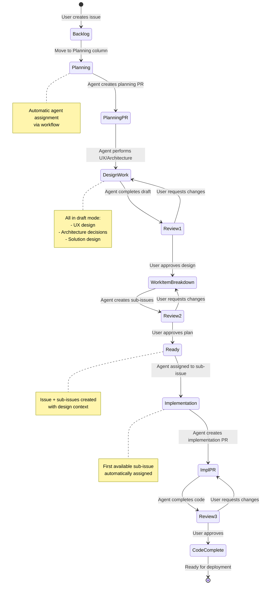

# Simplified A2D Flow

## Overview

This document describes the A2D workflow from an **end-user perspective**, focusing on the natural progression from idea to implementation. The flow integrates UX design, solution architecture, and implementation planning into a cohesive workflow managed through GitHub project boards and pull requests.

**Key Principle:** A work item is not ready for implementation until UX design, architecture decisions, and work-item breakdown are complete and approved.

---

## Workflow Stages



---

## Detailed Flow

### Phase 1: Backlog → Planning

#### Step 1: User Creates Issue

**User Action:**
- Creates new GitHub issue with general intent and available details
- Leaves in Backlog (no status/column assignment)

**Example Issue:**
```markdown
Title: Add user authentication

Description:
We need to add authentication to protect user data. Users should be able to:
- Register with email/password
- Log in securely
- Reset forgotten passwords
- Stay logged in (remember me)

Current system has no auth infrastructure.
```

**Outcome:** Issue sits in Backlog awaiting prioritization

---

#### Step 2: User Prioritizes Work

**User Action:**
- Reviews backlog
- Moves issue to **Planning** column

**Trigger:**
- GitHub workflow detects issue moved to Planning
- **Automatically assigns issue to agent** (e.g., @copilot with codelantern agent)

**Outcome:** Agent is now responsible for creating comprehensive plan

---

### Phase 2: Planning → Design

#### Step 3: Agent Creates Planning PR

**Agent Action:**
- Detects assignment and Planning column status
- Analyzes issue description
- Creates planning branch: `planning/123-add-user-authentication`
- Opens **draft PR** with initial analysis

**Planning PR Contents (Initial):**
```markdown
## 🧠 Planning Analysis

**Issue:** #123 - Add user authentication
**Archetype:** Enhancement
**Complexity:** Medium-High

## Current Analysis

This initiative requires:
1. ✅ Analyzed requirement
2. ⏳ UX design (in progress)
3. ⏳ Architecture/solution design (in progress)
4. ⏳ Work-item breakdown (pending design completion)

## Next Steps

I'll now create UX designs and architecture proposals. This PR will remain in 
draft mode until all design work is complete and approved.
```

**Outcome:** Planning PR exists in draft mode, agent proceeds to design work

---

#### Step 4: Agent Performs Design Work (All in Draft)

**Agent Actions (Sequential):**

##### 4a. UX Design

Agent creates or references UX designs:

**Adds to Planning PR:**
```markdown
## 🎨 UX Design

### Login Flow
[Figma: Login/Register Mockups](link-to-figma)

**Key Screens:**
1. **Login Page**
   - Email/password inputs
   - "Remember me" checkbox
   - "Forgot password?" link
   - Social login options (future)

2. **Registration Page**
   - Email, password, confirm password
   - Password strength indicator
   - Terms acceptance

3. **Password Reset Flow**
   - Email input → verification code → new password

### Navigation Changes
- Add "Login" button to header (unauthenticated)
- Add user menu dropdown (authenticated)
  - Profile
  - Settings
  - Logout

**Design System:**
- Uses existing form components
- Follows brand color palette
- Mobile-responsive (all screens)
```

##### 4b. Architecture & Solution Design

Agent proposes technical architecture:

**Adds to Planning PR:**
```markdown
## 🏗️ Architecture & Solution Design

### Proposed Architecture

**Authentication Strategy:** JWT-based with refresh tokens

#### Backend (Node.js/Express)
```
src/
├── auth/
│   ├── auth.controller.ts    # Login, register, logout endpoints
│   ├── auth.service.ts       # Business logic
│   ├── jwt.strategy.ts       # JWT validation
│   ├── password.service.ts   # Hashing, validation
│   └── token.service.ts      # Token generation/refresh
├── middleware/
│   └── auth.middleware.ts    # Protected route middleware
└── users/
    ├── user.model.ts         # User entity
    └── user.repository.ts    # Database operations
```

#### Frontend (React)
```
src/
├── features/
│   └── auth/
│       ├── components/
│       │   ├── LoginForm.tsx
│       │   ├── RegisterForm.tsx
│       │   └── PasswordResetForm.tsx
│       ├── hooks/
│       │   └── useAuth.ts
│       ├── context/
│       │   └── AuthContext.tsx
│       └── api/
│           └── authApi.ts
```

### Technology Decisions

| Decision | Choice | Rationale |
|----------|--------|-----------|
| Password Hashing | bcrypt | Industry standard, adjustable cost |
| Token Type | JWT | Stateless, scalable |
| Token Storage | httpOnly cookie + localStorage | Secure + UX balance |
| Session Duration | 15min access, 7day refresh | Security + convenience |
| Database | Existing PostgreSQL | Leverage current stack |

### Security Considerations

- ✅ Passwords hashed with bcrypt (cost factor 12)
- ✅ JWT tokens signed with secret key (env variable)
- ✅ Refresh tokens stored in httpOnly cookies
- ✅ Rate limiting on auth endpoints (5 attempts/15min)
- ✅ Password requirements: 8+ chars, mixed case, number
- ⚠️ Future: 2FA/MFA (not in scope)
- ⚠️ Future: Social login (not in scope)

### Dependencies

**New Dependencies:**
- `bcryptjs` - Password hashing
- `jsonwebtoken` - JWT generation/validation
- `express-rate-limit` - Rate limiting

**No Breaking Changes:** Existing routes remain unchanged
```

##### 4c. Work-Item Breakdown (Draft)

Agent proposes implementation tasks:

**Adds to Planning PR:**
```markdown
## 📋 Proposed Work-Item Breakdown

Based on the UX and architecture design above, I propose the following sub-issues:

### Backend Tasks

**Sub-issue 1: User Model & Database Schema**
- Create User entity with email, password fields
- Add database migration
- Create user repository with CRUD operations
- **Acceptance Criteria:**
  - [ ] User table exists with required fields
  - [ ] Password field stores bcrypt hash
  - [ ] Migration runs successfully
  - [ ] Repository methods tested

**Sub-issue 2: Authentication Service & JWT**
- Implement password hashing/validation
- Implement JWT token generation
- Implement refresh token logic
- Create auth service with login/register/logout
- **Acceptance Criteria:**
  - [ ] Passwords hashed with bcrypt
  - [ ] JWT tokens generated with 15min expiry
  - [ ] Refresh tokens generated with 7day expiry
  - [ ] All auth service methods unit tested

**Sub-issue 3: Auth API Endpoints**
- POST /api/auth/register
- POST /api/auth/login
- POST /api/auth/logout
- POST /api/auth/refresh
- POST /api/auth/reset-password
- Add rate limiting middleware
- **Acceptance Criteria:**
  - [ ] All endpoints functional
  - [ ] Rate limiting active (5 req/15min)
  - [ ] Returns appropriate error codes
  - [ ] Integration tests passing

**Sub-issue 4: Protected Route Middleware**
- Create auth middleware for protected routes
- Apply to existing protected endpoints
- Handle token validation errors
- **Acceptance Criteria:**
  - [ ] Middleware validates JWT tokens
  - [ ] Returns 401 for invalid/missing tokens
  - [ ] Attaches user to request object
  - [ ] Applied to relevant routes

### Frontend Tasks

**Sub-issue 5: Auth Context & Hooks**
- Create AuthContext for global auth state
- Create useAuth hook
- Implement token storage/retrieval
- Handle token refresh logic
- **Acceptance Criteria:**
  - [ ] AuthContext provides login/logout/user state
  - [ ] useAuth hook accessible in components
  - [ ] Tokens stored securely
  - [ ] Auto-refresh before expiry

**Sub-issue 6: Login & Registration UI**
- Build LoginForm component per design
- Build RegisterForm component per design
- Implement form validation
- Connect to auth API
- **Acceptance Criteria:**
  - [ ] Forms match Figma designs
  - [ ] Client-side validation works
  - [ ] Success/error states handled
  - [ ] Responsive on mobile

**Sub-issue 7: Password Reset Flow**
- Build PasswordResetForm component
- Implement verification code flow
- Connect to reset API endpoint
- **Acceptance Criteria:**
  - [ ] Reset flow matches design
  - [ ] Email sent with reset code
  - [ ] Code validation works
  - [ ] New password saved

**Sub-issue 8: Protected Routes & Navigation**
- Add auth guards to protected routes
- Update navigation with login/user menu
- Handle unauthenticated redirects
- **Acceptance Criteria:**
  - [ ] Unauthenticated users redirected to login
  - [ ] Navigation shows correct state
  - [ ] User menu appears when logged in
  - [ ] Logout works correctly

### Testing & Documentation

**Sub-issue 9: Testing & Documentation**
- E2E tests for auth flows
- Update API documentation
- Update user documentation
- Security testing
- **Acceptance Criteria:**
  - [ ] E2E tests cover login/register/logout
  - [ ] API docs updated with auth endpoints
  - [ ] User guide includes auth instructions
  - [ ] Security review complete

---

**Total Sub-issues:** 9
**Estimated Duration:** 3-4 sprints
**Dependencies:** Sub-issues 1-4 should complete before 5-8
```

**Outcome:** Planning PR now contains complete design work (UX + Architecture + Breakdown)

---

### Phase 3: Review & Iteration (Round 1 - Design)

#### Step 5: Agent Signals Ready for Review

**Agent Action:**
- Updates PR description with "✅ Design work complete"
- Adds comment: "@user This planning PR is ready for design review"

**Planning PR Status:**
```markdown
## Status: 🎨 Design Review

✅ UX Design complete
✅ Architecture design complete  
✅ Work-item breakdown drafted

**Ready for your review!** Please review:
1. UX designs and navigation changes
2. Architecture decisions and technology choices
3. Proposed work-item breakdown

Let me know if you'd like any changes before I create the final work items.
```

---

#### Step 6: User Reviews Design Work

**User Action:**
- Reviews PR contents (UX, architecture, breakdown)
- Provides feedback via PR comments

**Example Feedback:**
```markdown
Overall looks good! A few changes:

1. **UX:** Let's skip the social login buttons for now (even as future)
2. **Architecture:** Can we use 30min access tokens instead of 15min? 
   Users complained about frequent logouts on the last project.
3. **Breakdown:** Sub-issue 7 (password reset) is lower priority. 
   Can we move that to a future phase?
```

---

#### Step 7: Agent Iterates on Design

**Agent Action:**
- Reads feedback
- Updates planning PR with requested changes
- Pushes new commits to planning branch
- Comments when ready for re-review

**Updated Planning PR:**
```markdown
## 🎨 UX Design (Updated)

### Login Flow
[Figma: Login/Register Mockups - Updated](link)

**Changes:**
- ❌ Removed social login buttons (was future, now out of scope)
```

```markdown
## 🏗️ Architecture & Solution Design (Updated)

### Technology Decisions

| Decision | Choice | Rationale |
|----------|--------|-----------|
| Session Duration | **30min access**, 7day refresh | **Updated per feedback** |
```

```markdown
## 📋 Updated Work-Item Breakdown

**Changes:**
- ❌ Removed Sub-issue 7 (Password Reset) - moved to future phase
- Updated Sub-issue 9 to reflect reduced scope

**Total Sub-issues:** 8 (was 9)
**Estimated Duration:** 2-3 sprints (was 3-4)
```

**Agent Comment:**
```markdown
✅ Updates complete! Changes made:
1. Removed social login from UX
2. Updated token expiry to 30min
3. Removed password reset flow (future phase)

Ready for re-review.
```

**Outcome:** User and agent iterate until design is approved

---

### Phase 4: Finalize Work Items

#### Step 8: User Approves Design

**User Action:**
- Reviews updated design
- Comments: "Approved! Please create the work items."

---

#### Step 9: Agent Creates Final Work Items

**Agent Action:**
- Creates main tracking issue (if needed)
- Creates 8 sub-issues from the approved breakdown
- Each sub-issue includes:
  - Link to planning PR for full context
  - Relevant UX design screenshots/links
  - Architecture decisions that apply
  - Acceptance criteria
  - Dependencies
- Links all sub-issues to parent issue #123
- Updates planning PR with issue links

**Example Sub-Issue Created:**

```markdown
Title: Auth Backend - Authentication Service & JWT

**Parent Issue:** #123 - Add user authentication
**Planning PR:** #125 (contains full UX and architecture context)

## Description

Implement the core authentication service with JWT token generation as 
defined in the planning PR.

## Architecture Reference

See [Planning PR Architecture Section](#) for full details:
- JWT tokens with 30min expiry
- Refresh tokens with 7day expiry
- bcrypt password hashing (cost factor 12)

## Tasks

- [ ] Implement password hashing/validation with bcrypt
- [ ] Implement JWT token generation
- [ ] Implement refresh token logic
- [ ] Create auth service with login/register/logout methods

## Acceptance Criteria

- [ ] Passwords hashed with bcrypt (cost 12)
- [ ] JWT tokens generated with 30min expiry
- [ ] Refresh tokens generated with 7day expiry
- [ ] All auth service methods have unit tests (>80% coverage)

## Dependencies

**Depends on:** #126 (User Model & Database Schema)

## Labels

`ready-for-implementation`, `backend`, `auth`, `enhancement`
```

---

#### Step 10: Agent Completes Planning PR

**Agent Action:**
- Updates planning PR to "Ready for Merge"
- Marks PR as ready for review (removes draft status)
- Adds final summary comment

**Planning PR - Final State:**
```markdown
## ✅ Planning Complete

**Main Issue:** #123 - Add user authentication  
**Planning PR:** #125

### Created Sub-Issues

- #126 - User Model & Database Schema
- #127 - Authentication Service & JWT
- #128 - Auth API Endpoints
- #129 - Protected Route Middleware
- #130 - Auth Context & Hooks
- #131 - Login & Registration UI
- #132 - Protected Routes & Navigation
- #133 - Testing & Documentation

### Summary

✅ UX Design approved (Figma linked)  
✅ Architecture approved (JWT-based auth)  
✅ 8 sub-issues created with acceptance criteria  
✅ Dependencies documented

**All issues ready for implementation.**

Ready to merge this planning PR and move issues to Ready column.
```

---

#### Step 11: User Approves Planning PR

**User Action:**
- Reviews final PR state
- Approves PR
- Merges planning PR

**Outcome:** Planning branch merged to main

---

#### Step 12: Issues Move to Ready

**Automatic Action (via GitHub workflow):**
- All sub-issues (#126-#133) move to **Ready** column
- Main issue #123 moves to **Ready** column

**Project Board State:**

```
Ready Column:
├── #123 - Add user authentication (parent)
├── #126 - User Model & Database Schema ⭐ (no dependencies)
├── #127 - Authentication Service & JWT (depends on #126)
├── #128 - Auth API Endpoints (depends on #127)
├── #129 - Protected Route Middleware (depends on #128)
├── #130 - Auth Context & Hooks ⭐ (no dependencies)
├── #131 - Login & Registration UI (depends on #130)
├── #132 - Protected Routes & Navigation (depends on #131)
└── #133 - Testing & Documentation (depends on all)
```

---

### Phase 5: Implementation

#### Step 13: Agent Auto-Assigned to First Sub-Issue

**Automatic Action (via GitHub workflow):**
- Detects sub-issues in Ready column with no dependencies
- Assigns first available sub-issue to agent
- In this case: **#126 - User Model & Database Schema**

**Trigger:** Issue #126 assigned to @copilot (codelantern agent)

---

#### Step 14: Agent Creates Implementation PR

**Agent Action:**
- Detects assignment to issue #126
- Creates implementation branch: `feat/126-user-model-database`
- Opens **draft PR** for implementation

**Implementation PR Contents (Initial):**
```markdown
## Implementation: User Model & Database Schema

**Issue:** #126  
**Parent Issue:** #123 - Add user authentication  
**Planning Reference:** PR #125

## Plan

Implementing user model and database schema as defined in planning:

- [ ] Create User entity (email, password, createdAt, updatedAt)
- [ ] Create database migration
- [ ] Create user repository with CRUD operations
- [ ] Write unit tests

## Architecture Context

From planning PR #125:
- Password field stores bcrypt hash
- PostgreSQL database (existing)
- User table structure defined

I'll implement this now.
```

---

#### Step 15: Agent Implements Code

**Agent Actions:**
- Reads planning PR for context
- Implements code per acceptance criteria
- Writes tests
- Commits to implementation branch
- Runs tests locally
- Updates PR with progress

**Implementation PR - In Progress:**
```markdown
## ✅ Progress

- [x] Created User entity
- [x] Created database migration  
- [x] Created user repository
- [x] Unit tests written (85% coverage)
- [ ] Ready for review
```

**Commits:**
```
feat: add User entity with email and password fields
feat: add database migration for users table
feat: add UserRepository with CRUD operations
test: add unit tests for UserRepository
```

---

#### Step 16: Agent Signals Ready for Review

**Agent Action:**
- Marks PR as ready for review (removes draft status)
- Adds comment: "@user Implementation complete, ready for review"
- Issue #126 automatically moves to **In Review** column

**Implementation PR - Ready State:**
```markdown
## ✅ Implementation Complete

All acceptance criteria met:

- [x] User table exists with required fields
- [x] Password field stores bcrypt hash
- [x] Migration runs successfully
- [x] Repository methods tested (85% coverage)

**Tests:** ✅ All passing (12/12)  
**Coverage:** 85%  
**Linting:** ✅ No issues

Ready for your review!
```

---

### Phase 6: Review & Iteration (Round 2 - Implementation)

#### Step 17: User Reviews Implementation

**User Action:**
- Pulls branch locally
- Reviews code changes
- Tests functionality
- Provides feedback

**Example Feedback:**
```markdown
Looks good overall! A few things:

1. Can you add an index on the email field for faster lookups?
2. The password validation should also check for special characters
3. Add a `lastLoginAt` timestamp field
```

---

#### Step 18: Agent Makes Changes

**Agent Action:**
- Reads feedback
- Makes requested changes
- Pushes new commits
- Comments when ready for re-review

**New Commits:**
```
feat: add email index for faster user lookups
feat: add special character requirement to password validation
feat: add lastLoginAt timestamp to User entity
test: update tests for new validation rules
```

**Agent Comment:**
```markdown
✅ Changes complete:
1. Added index on email field (see migration update)
2. Password validation now requires special character
3. Added lastLoginAt field with auto-update on login

Ready for re-review.
```

**Outcome:** User and agent iterate until code is approved

---

### Phase 7: Code Complete

#### Step 19: User Approves Implementation PR

**User Action:**
- Reviews changes
- Runs tests locally
- Approves PR
- Merges implementation PR

**Outcome:** Feature branch merged to main

---

#### Step 20: Issue Moves to Code Complete

**Automatic Action (via GitHub workflow):**
- Issue #126 moves to **Code Complete** column
- Issue #126 closed (status: completed)
- GitHub workflow checks for next ready sub-issue

**Project Board State:**

```
Code Complete Column:
└── #126 - User Model & Database Schema ✅

Ready Column:
├── #123 - Add user authentication (parent)
├── #127 - Authentication Service & JWT ⭐ (dependencies now met)
├── #128 - Auth API Endpoints
├── #129 - Protected Route Middleware
├── #130 - Auth Context & Hooks ⭐ (no dependencies)
├── #131 - Login & Registration UI
├── #132 - Protected Routes & Navigation
└── #133 - Testing & Documentation
```

---

#### Step 21: Next Sub-Issue Auto-Assigned

**Automatic Action:**
- Workflow detects #127 and #130 have no remaining dependencies
- Assigns next sub-issue to agent (e.g., #127)
- **Cycle repeats** from Step 14

---

## Project Board Flow Summary

```
Backlog
  ↓ (User moves to Planning)
Planning (Agent auto-assigned)
  ↓ (Agent creates planning PR)
Planning PR (Draft - Design Work)
  ↓ (User reviews & approves)
Ready (Sub-issues created)
  ↓ (Agent auto-assigned to sub-issue)
In Progress (Implementation PR created)
  ↓ (Agent implements)
In Review (User reviews)
  ↓ (User approves & merges)
Code Complete
  ↓ (Deployment process - separate flow)
Done
```

---

## Key Workflow Automations

### 1. Auto-Assign to Agent (Planning)

**Trigger:** Issue moved to Planning column  
**Action:** Assign issue to @copilot (codelantern agent)

```yaml
# .github/workflows/auto-assign-planning.yml
name: Auto-assign Planning
on:
  project_card:
    types: [moved]
jobs:
  assign:
    if: github.event.project_card.column_name == 'Planning'
    runs-on: ubuntu-latest
    steps:
      - name: Assign to Copilot
        uses: actions/github-script@v6
        with:
          script: |
            github.rest.issues.addAssignees({
              owner: context.repo.owner,
              repo: context.repo.repo,
              issue_number: context.payload.project_card.content_url.split('/').pop(),
              assignees: ['copilot']
            });
```

### 2. Auto-Assign to Agent (Implementation)

**Trigger:** Sub-issue in Ready column with no dependencies  
**Action:** Assign to @copilot

### 3. Auto-Move to In Review

**Trigger:** Implementation PR marked ready for review  
**Action:** Move linked issue to In Review column

### 4. Auto-Move to Code Complete

**Trigger:** Implementation PR merged  
**Action:** Move linked issue to Code Complete, close issue

---

## Benefits of This Flow

### ✅ Comprehensive Planning
- UX, architecture, and breakdown all done upfront
- No surprises during implementation
- Clear acceptance criteria

### ✅ Draft Mode for Design Work
- Agent explores options without committing
- User reviews before work items created
- Iterate cheaply before implementation starts

### ✅ Clear Approval Gates
- Design approval before work items created
- Implementation approval before merge
- User maintains control

### ✅ Automated Workflow
- Auto-assignment reduces manual work
- Column movements trigger actions
- Natural progression through stages

### ✅ Full Context for Implementation
- Sub-issues link back to planning PR
- Architecture decisions documented
- UX designs referenced
- Clear acceptance criteria

### ✅ Parallel Work Possible
- Independent sub-issues can be worked simultaneously
- Dependencies clearly marked
- Team can assist agent with parallel tracks

---

## Next: Deployment Flow

Once all sub-issues are in Code Complete, a separate deployment workflow would:
- Run final integration tests
- Create release branch
- Deploy to staging
- Run smoke tests
- Deploy to production
- Move issues to Done

**This deployment flow is separate** and would be documented in a future artifact.

---

**Version:** 1.0  
**Last Updated:** November 27, 2025

---

© 2025 TechLantern / CodeLantern.AI. For internal use and approved partner engagements only.
