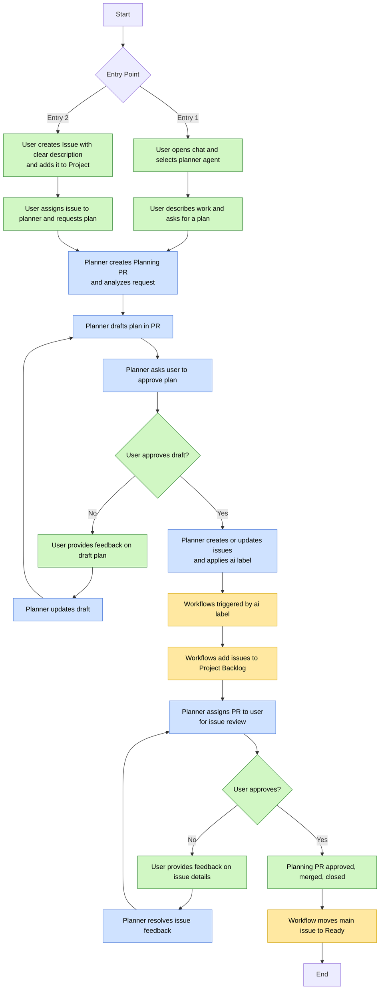
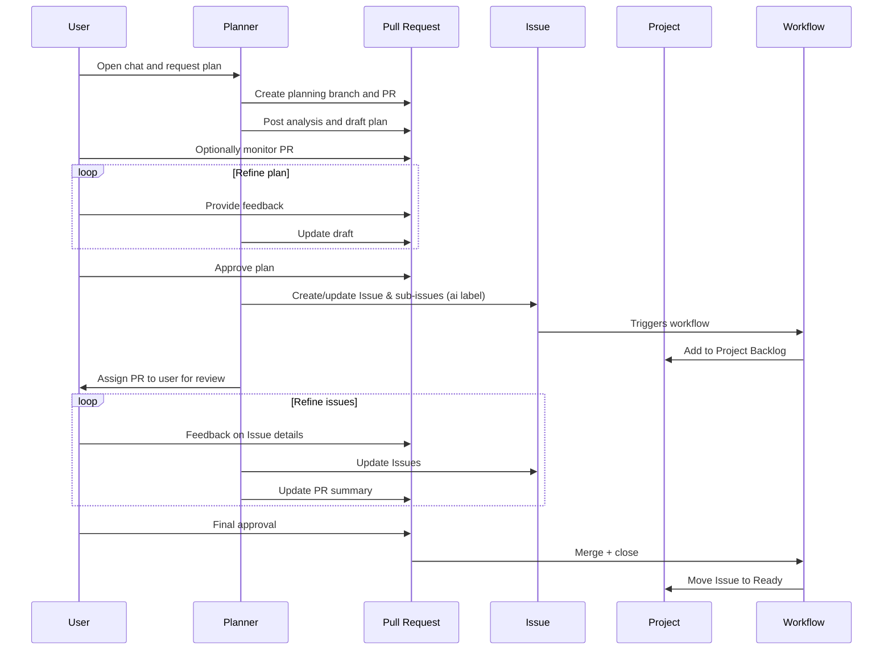
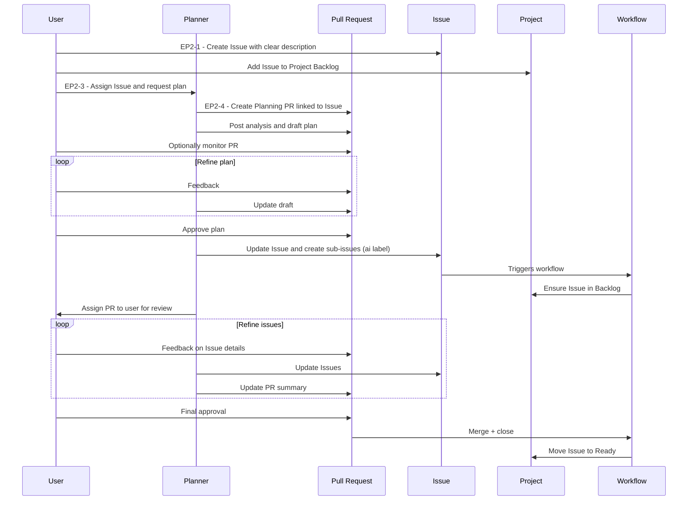

# A2D Planning Workflow – Planner (vNext)

This document describes the **A2D planning workflow** for the `codelantern-planner` agent, including:

1. Textual description of the planning flow  
2. A **flowchart** of the overall planning workflow  
3. A **sequence diagram for Entry Point 1**  
4. A **sequence diagram for Entry Point 2**  

---

## 1. Textual Description of the Planning Flow

### Entry Point 1 – Start from Chat (No Existing Issue)

1. User opens a new chat session in GitHub.  
2. User selects the `codelantern-planner` agent.  
3. User describes the initiative and requests a plan.  
4. Planner creates a planning branch and opens a draft PR.  
5. User can optionally monitor the PR and provide live feedback.  
6. Planner performs analysis and drafts the plan ending with candidate "next steps".
7. User approves the plan through PR comments, leaving the PR open.  
8. Planner creates/updates the main issue, optionally adds sub-issues and attaches the `ai` label.
9. Workflows trigger on the `ai` label.  
10. Workflows add issues to the Backlog.  
11. Planner assigns PR back to the user for final review.  
12. User and planner iterate on issues and plan summaries.  
14. User approves the PR; planner merges and closes it.  
15. Workflows move the Issue into Ready.

### Entry Point 1 – More detailed (we should likely choose either this or the more summarized text)

1. **User opens a new chat session** in the GitHub browser for an A2D-enabled repository.  
1. **User selects the `codelantern-planner` agent** in the chat interface.  
1. **User describes the initiative** and asks the planner to create a plan (for example, “Please create a plan for the following…”).  
1. **Planner creates a planning branch and draft PR** dedicated to analysis and planning (no implementation work yet).  
1. **User can monitor the PR** by adding comments and feedback as the planner works.  
1. **Planner performs analysis and drafts the plan** posting the proposed approach and clear candidate “next steps” into the draft PR.  
1. **User approves the plan** by adding comments to the PR, but does not approve or close the PR. This signals the planner to create structured work items (issues and sub-issues).  
1. **Planner creates or updates a main GitHub Issue and Sub-issues** as needed, applying the `ai` label to all issues it creates or manages.  
1. **GitHub workflows trigger on the `ai` label**, automatically adding the issue(s) to the correct Project.  
1. **Workflows also ensure issues are placed into the Project Backlog** column.  
1. **Planner assigns the Planning PR back to the user** for final review of the created or updated issues and sub-issues.  
1. **User and planner iterate on both the plan and the issues**:  
    - User provides feedback via PR comments.  
    - Planner updates the plan text, issue titles, descriptions, and links.  
1. **User gives final approval** on the Planning PR, which is then merged into `main`, closed, and the planning branch deleted.  
1. **GitHub workflows move the main issue into the Ready column**, indicating it is ready for development or assignment to the `codelantern-coder` agent.

---

### Entry Point 2 – Start from an Existing Issue

EP2‑1. User creates a GitHub Issue with a clear description and adds it to the Project backlog.  
EP2‑2. User assigns the Issue to Copilot, selects the planner agent, and prompts:  
> “Please create a plan for this work item (#123).”

EP2‑3. Planning proceeds exactly from Step 4 of Entry Point 1.

---

## 2. Flowchart – Overall Planning Workflow

---

## 3. Sequence Diagram – Entry Point 1 (Start from Chat)

---

## 4. Sequence Diagram – Entry Point 2 (Start from Existing Issue)

---

Copyright  CodeLantern 2025
