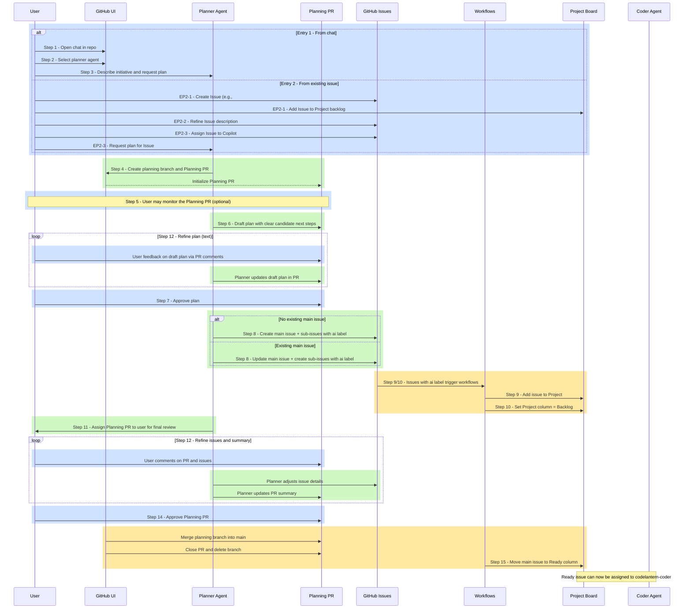
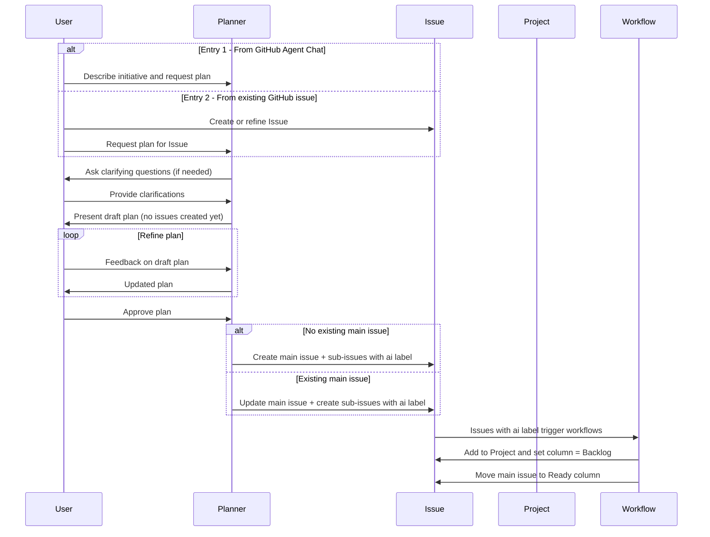
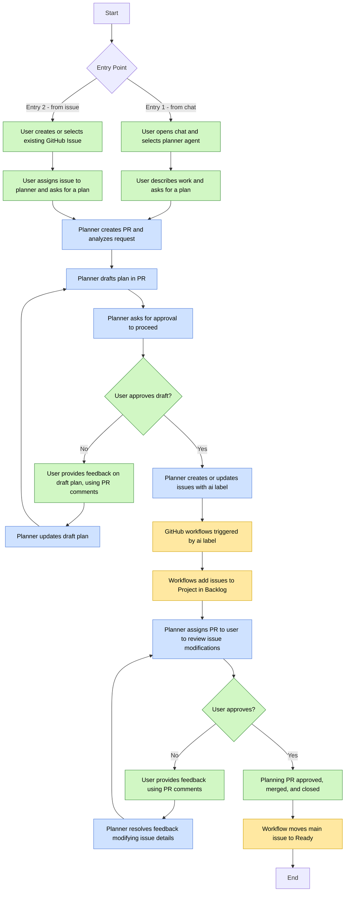

# A2D Planning Workflow – Planner (vNext)

This document describes the **A2D planning workflow** for the `codelantern-planner` agent, including:

1. A textual description of the planning flow (with numbered steps and entry points)  
2. A **full sequence diagram** (with both entry points) – visually grouped by role  
3. A **simplified sequence diagram** – also grouped by role  
4. A **color-coded flowchart** – suitable for slides or video

Color scheme used conceptually:

- **Human (User, manual actions):** blue  
- **AI (Planner / Codelantern agents):** green  
- **GitHub Automation / Workflows / Project board:** yellow  

Sequence diagrams use **highlight rectangles (`rect` blocks)** to group regions by role.  
The flowchart uses **explicit color styling** for nodes.

---

## 1. Textual Description of the Planning Flow

### Entry Point 1 – Start from Chat (No Existing Issue)

1. **User opens a new chat session** in the GitHub browser for an A2D-enabled repository.  
1. **User selects the `codelantern-planner` agent** in the chat interface.  
1. **User describes the initiative** and asks the planner to create a plan (for example, “Please create a plan for the following…”).  
1. **Planner creates a planning branch and Planning PR** dedicated to analysis and planning (no implementation work yet).  
1. **User can monitor the Planning PR (optional)** – they may watch comments and interim updates as the planner works.  
1. **Planner performs analysis and drafts a plan**, posting the proposed approach and clear candidate “next steps” into the Planning PR.  
1. **User approves the plan** (Adding comments to the PR, but does not Approve or Close the PR), signaling that the planner can now create structured work items.  
1. **Planner creates or updates a main GitHub Issue and Sub-issues** as needed, applying the `ai` label to all issues it creates or manages.  
1. **GitHub workflows trigger on the `ai` label**, automatically adding the issue(s) to the correct Project.  
1. **Workflows also ensure issues are placed into the Project Backlog** column.  
1. **Planner assigns the Planning PR back to the user** for final review the created or updated issues and sub-issues.  
1. **User and planner iterate on both the plan and the issues**:  
    - User provides feedback via PR comments.  
    - Planner updates the plan text, issue titles, descriptions, and links.  
1. **User gives final approval** on the Planning PR, which is then merged into `main`, closed, and the planning branch deleted.  
1. **GitHub workflows move the main issue into the Ready column**, indicating it is ready for development or assignment to the `codelantern-coder` agent.

---

### Entry Point 2 – Start from an Existing Issue

EP2-1. **User creates a GitHub Issue** that describes a bug, enhancement, or refactoring and adds it to the Project backlog.  
EP2-2. **User refines the Issue** (title, description, acceptance criteria) until it is a clear statement of work.  
EP2-3. **User assigns the Issue to Copilot**, selects the `codelantern-planner` agent, and uses a simple prompt such as:  
> “Please create a plan for this work item (#123).”

EP2-4. **From here, the flow is the same as Entry Point 1 from Step 4 onward**:  

- Planner creates a Planning PR linked to the issue,  
- Performs analysis and drafts a plan,  
- Awaits user approval,  
- Creates/updates issues with the `ai` label,  
- Workflows add to Project + Backlog and later move to Ready,  
- The Planning PR is reviewed, approved, merged, and closed.

---

## 2. Full Sequence Diagram (Role-Grouped)

---

## 3. Simplified Sequence Diagram

---

## 4. Color-Coded Flowchart (Human vs AI vs Automation)

The flowchart below uses explicit node styling to match the conceptual colors used in the sequence diagrams.

---

Generated automatically by **CodeLantern – A2D Workflow Tools (vNext)**.
