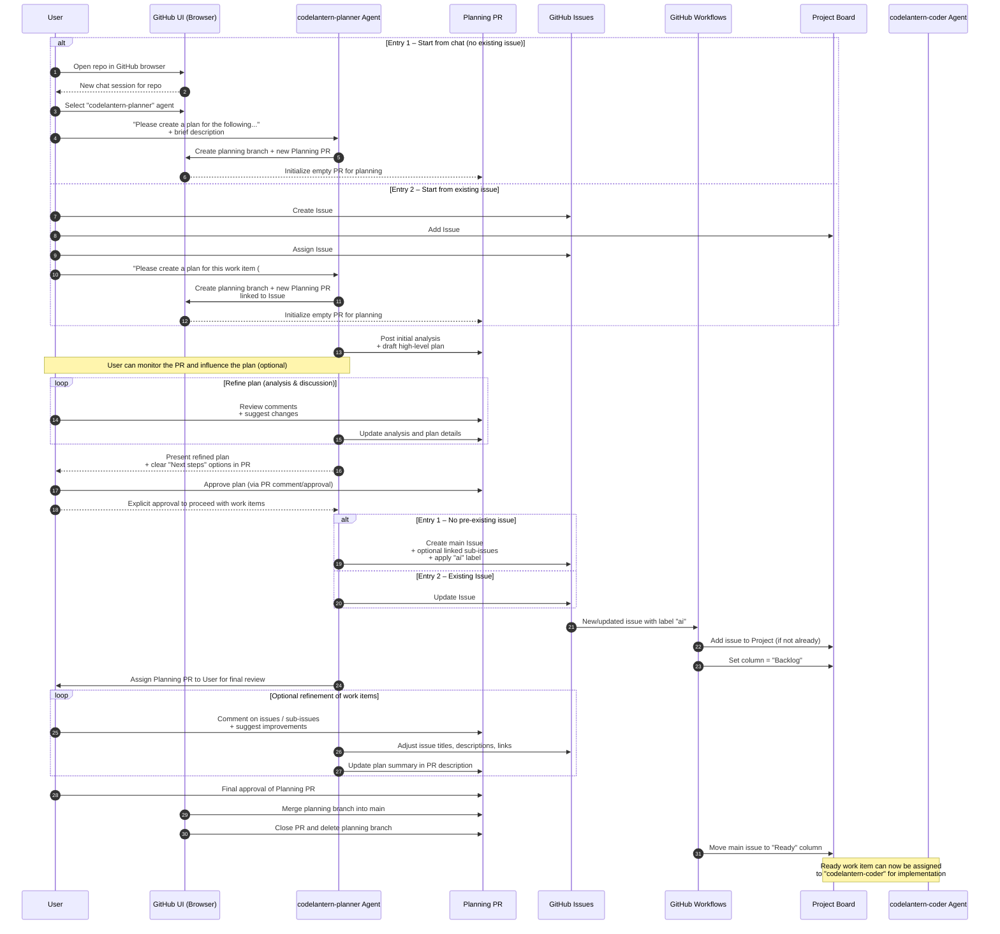

# Planning Workflow

```mermaid
sequenceDiagram
    autonumber

    participant U as User
    participant GH as GitHub UI (Browser)
    participant CP as codelantern-planner Agent
    participant PR as Planning PR
    participant IS as GitHub Issues
    participant WF as GitHub Workflows
    participant PJ as Project Board
    participant CC as codelantern-coder Agent

    %% ─────────────────────────────────────────
    %% Two alternative entry points
    %% ─────────────────────────────────────────
    alt Entry 1 – Start from chat (no existing issue)
        U->>GH: Open repo in GitHub browser
        GH-->>U: New chat session for repo
        U->>GH: Select "codelantern-planner" agent
        U->>CP: "Please create a plan for the following..."<br/>+ brief description
        CP->>GH: Create planning branch + new Planning PR
        GH-->>PR: Initialize empty PR for planning
    else Entry 2 – Start from existing issue
        U->>IS: Create Issue #123<br/>with brief description
        U->>PJ: Add Issue #123 to Project backlog
        U->>IS: Assign Issue #123 to Copilot
        U->>CP: "Please create a plan for this work item (#123)"
        CP->>GH: Create planning branch + new Planning PR<br/>linked to Issue #123
        GH-->>PR: Initialize empty PR for planning
    end

    %% ─────────────────────────────────────────
    %% Planner does analysis and creates plan
    %% ─────────────────────────────────────────
    CP->>PR: Post initial analysis<br/>+ draft high-level plan
    Note over U,CP: User can monitor the PR and influence the plan (optional)

    loop Refine plan (analysis & discussion)
        U->>PR: Review comments<br/>+ suggest changes
        CP->>PR: Update analysis and plan details
    end

    CP-->>U: Present refined plan<br/>+ clear "Next steps" options in PR

    %% ─────────────────────────────────────────
    %% User approves the plan
    %% ─────────────────────────────────────────
    U->>PR: Approve plan (via PR comment/approval)
    U-->>CP: Explicit approval to proceed with work items

    %% ─────────────────────────────────────────
    %% Work-item creation / update
    %% ─────────────────────────────────────────
    alt Entry 1 – No pre-existing issue
        CP->>IS: Create main Issue<br/>+ optional linked sub-issues<br/>+ apply "ai" label
    else Entry 2 – Existing Issue #123
        CP->>IS: Update Issue #123 with final plan<br/>+ create linked sub-issues<br/>+ ensure "ai" label applied
    end

    IS->>WF: New/updated issue with label "ai"
    WF->>PJ: Add issue to Project (if not already)
    WF->>PJ: Set column = "Backlog"

    %% ─────────────────────────────────────────
    %% Final PR review cycle
    %% ─────────────────────────────────────────
    CP->>U: Assign Planning PR to User for final review

    loop Optional refinement of work items
        U->>PR: Comment on issues / sub-issues<br/>+ suggest improvements
        CP->>IS: Adjust issue titles, descriptions, links
        CP->>PR: Update plan summary in PR description
    end

    U->>PR: Final approval of Planning PR
    GH->>PR: Merge planning branch into main
    GH->>PR: Close PR and delete planning branch

    %% ─────────────────────────────────────────
    %% Issue moves to Ready for development
    %% ─────────────────────────────────────────
    WF->>PJ: Move main issue to "Ready" column
    Note over PJ,CC: Ready work item can now be assigned<br/>to "codelantern-coder" for implementation
```
